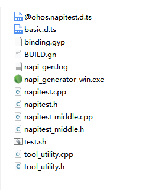

# napi_generator

## 简介
本文主要介绍NAPI框架代码生成工具，它可以根据用户指定路径下的ts接口文件一键生成NAPI框架代码、业务代码框架、GN文件等。在开发JS应用与NAPI间接口时，底层框架开发者无需关注Nodejs语法、C++与JS之间的数据类型转换等上层应用转换逻辑，只关注底层业务逻辑即可，专业的人做专业的事，从而可以大大提高开发效率。目前工具支持可执行文件、VS插件、IntelliJ插件三种入口。
软件架构如下：


## 目录

```
├── napi_generator                # NAPI框架代码生成工具
│   ├── docs                      # 工具说明、版本规划
│   ├── figures                   # 图片资源文件
│   ├── prebuilt                  # 可执行文件、插件文件
│   ├── release-notes             # 发布说明
│   ├── src                       # 工具源码
|   |   ├── gen                  
│   |   |   ├── analyze           # 解析器
│   |   |   |── extend            # 扩展模块，包括gn文件生成、linux环境适配代码等
│   │   |   |── generate          # 生成器
│   │   |   └── tools             # 公共模块代码，包括消息体校验、文件读写、正则表达式转换等  
|   |   └── generator             #IntelliJ IDEA插件代码
|   ├── examples                  # 工具需要的ts文件样例  
│   └── README                    # 工具使用指导    

```
## 约束
系统：建议Ubuntu 20.04或者Windows 10

依赖版本：vscode 1.62.0

## 使用方法
工具支持三种入口，分别是可执行文件、VS插件、IntelliJ插件，使用方法如下：
   https://gitee.com/openharmony-sig/napi_generator/blob/master/docs/INSTRUCTION_ZH.md


## 说明
### 使用场景

1) 系统框架层新增子系统，需对应用层提供接口

2) 系统框架层已有子系统增强能力后，需对应用层提供新接口

### 使用对象
系统框架开发者

### 使用效果
根据指定的ts文件生成C/C++接口框架，如examples/ts/@ohos.napitest.d.ts转换后生成napitest.cpp文件。
效果图如下：


```c++
#include "napitest.h"


namespace napitest {

bool TestClass1::if_direct(std::string &v1, std::string &out) {
    // TODO
    return true;
}

bool TestClass1::if_callback(std::string &v1, std::string &out) {
    // TODO
    return true;
}

......
}
```


### 工具开发说明

开发者可以基于已有源码进行工具二次开发，编译打包生成自定义的可执行文件和插件。工具开发说明如下：

   https://gitee.com/openharmony-sig/napi_generator/blob/master/docs/DEVELOP_ZH.md

## FAQ
对于常见问题解决方法指导如下：
https://gitee.com/openharmony-sig/napi_generator/blob/master/FAQ.md

## 参与贡献

暂无

## 相关仓

暂无
