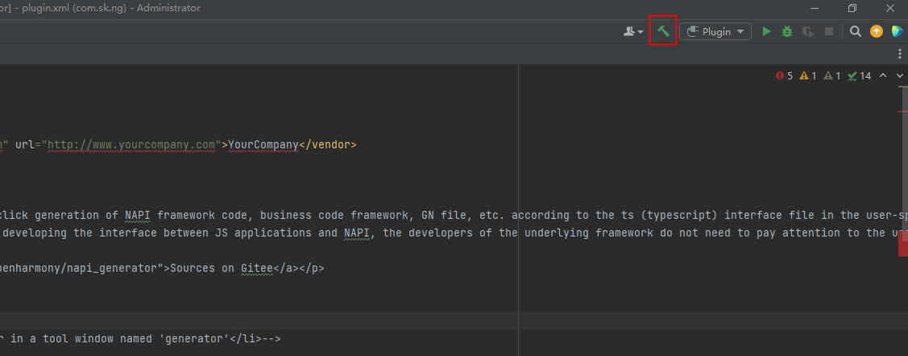

# NAPI框架生成工具开发说明

若当前工具功能不满足开发者需求，开发者需增强工具能力，则可基于已有源码进行工具二次开发，编译打包生成自定义的可执行文件和插件。

## 工具开发

### 可执行文件开发说明

#### 环境说明

系统：建议Ubuntu 20.04或者Windows 10

#### 开发步骤

##### Linux

1.安装typescript：在napi_generator/src目录下执行命令：

	npm i typescript

2.安装stdio：在napi_generator目录下执行命令：

	npm i stdio

3.安装pkg : 在napi_generator目录下执行命令：

	sudo npm i -g pkg

4.打包三个版本 : 执行命令：

	pkg .

执行以上步骤后，即可在napi_generator目录下生成Windows、linux、mac系统下的可执行程序:

	napi_generator-win.exe、napi_generator-linux、napi_generator-macos

5.根据需求打包指定系统下的可执行文件。若想只打包windows系统下可执行文件，可执行命令：

	pkg -t node14-win . -o napi_generator-win.exe

若想只打包linux系统下可执行文件，可执行命令：

	pkg -t node14-linux . -o napi_generator-linux

若想只打包macos系统下可执行文件，可执行命令：

	pkg -t node14-macos . -o napi_generator-macos

备注：参数-t为指定系统，参数-o为指定可执行文件名称。

##### Windows

1.安装typescript：使用管理员身份在napi_generator/src目录下执行命令：

	npm i typescript

2.安装stdio：使用管理员身份在napi_generator目录下执行命令：

	npm i stdio

3.安装pkg : 使用管理员身份在napi_generator目录下执行命令：

	npm i -g pkg

4.打包三个版本 : 使用管理员身份执行命令：

	pkg .

执行以上步骤后，即可在napi_generator目录下生成Windows、linux、mac系统下的可执行程序:

	napi_generator-win.exe、napi_generator-linux、napi_generator-macos

5.根据需求打包指定系统下的可执行文件。若想只打包windows系统下可执行文件，可执行命令：

	pkg -t node14-win . -o napi_generator-win.exe

若想只打包linux系统下可执行文件，可执行命令：

	pkg -t node14-linux . -o napi_generator-linux

若想只打包macos系统下可执行文件，可执行命令：

	pkg -t node14-macos . -o napi_generator-macos

### VS插件开发说明

#### Linux

1.在napi_generator目录下，将napi_generator-linux可执行文件复制到napi_generator/napi_vs_plugin/src/目录下，执行命令如下：

	cp napi_generator-linux napi_vs_plugin/src/

2.在napi_generator/napi_vs_plugin/src目录下执行命令：

	npm i

3.在napi_generator/napi_vs_plugin/src目录下执行命令：

	npm i typescript

4.在napi_generator/napi_vs_plugin/src目录下执行命令：

	npm i vsce

5.在napi_generator/napi_vs_plugin/src目录下执行命令：

	npx vsce package

  每个选项都选择y，然后回车，最终会在当前目录下打包生成一个插件gnapi-0.0.1.vsix。结果如下：

	harmony@Ubuntu-64:~/napi/napi_generator_5/napi_vs_plugin/src$ npx vsce package
	WARNING  A 'repository' field is missing from the 'package.json' manifest file.
	Do you want to continue? [y/N] y
	WARNING  Using '*' activation is usually a bad idea as it impacts performance.
	More info: https://code.visualstudio.com/api/references/activation-events#Start-up
	Do you want to continue? [y/N] y
	WARNING  LICENSE.md, LICENSE.txt or LICENSE not found
	Do you want to continue? [y/N] y
	This extension consists of 3370 files, out of which 1627 are JavaScript files. For performance reasons, you should bundle your extension: https://aka.ms/vscode-bundle-extension . You should also exclude unnecessary files by adding them to your .vscodeignore: https://aka.ms/vscode-vscodeignore
	DONE  Packaged: /home/harmony/napi/napi_generator_5/napi_vs_plugin/src/gnapi-0.0.1.vsix (3370 files, 44.42MB)

#### Windows

1.将napi_generator目录下的napi_generator-win.exe可执行文件复制到napi_generator/napi_vs_plugin/src/目录下。

2.在napi_generator/napi_vs_plugin/src目录下执行命令：

	npm i

3.在napi_generator/napi_vs_plugin/src目录下执行命令：

	npm i typescript

4.在napi_generator/napi_vs_plugin/src目录下执行命令：

	npm i vsce

5.在napi_generator/napi_vs_plugin/src目录下执行命令：

	npx vsce package

  每个选项都选择y，然后回车，最终会在当前目录下打包生成一个插件gnapi-0.0.1.vsix。结果如下：

	E:\napi_generator\napi_generator-master\napi_vs_plugin\src>npx vsce package
	WARNING  A 'repository' field is missing from the 'package.json' manifest file.
	Do you want to continue? [y/N] y
	WARNING  Using '*' activation is usually a bad idea as it impacts performance.
	More info: https://code.visualstudio.com/api/references/activation-events#Start-up
	Do you want to continue? [y/N] y
	WARNING  LICENSE.md, LICENSE.txt or LICENSE not found
	Do you want to continue? [y/N] y
	This extension consists of 3467 files, out of which 1692 are JavaScript files. For performance reasons, you should bundle your extension: https://aka.ms/vscode-bundle-extension . You should also exclude unnecessary files by adding them to your .vscodeignore: https://aka.ms/vscode-vscodeignore
	DONE  Packaged: E:\napi_generator\napi_generator-master\napi_vs_plugin\src\gnapi-0.0.1.vsix (3467 files, 42.3MB)

### IntelliJ插件开发说明

#### 环境说明

系统：建议Windows 10

#### 开发步骤

1.将napi_generator目录下的可执行文件分别放置在napi_generator/src/generator/resources/cmds目录下对应系统的文件夹下。

2.通过IntelliJ IDEA打开napi_generator/src/generator目录下的代码。

3.基础环境配置按照IDEA插件开发环境配置操作，确保项目可运行，且.d.ts文件可正常生成框架代码。

[IDEA插件开发环境配置](https://gitee.com/openharmony/napi_generator/blob/master/src/generator/README_zh.md)

4.点击Intellij IDEA工具右上角Built Project按钮，等待工程built完成。

5.在IDEA Community中依次点击Build>Prepare All Plugin Modules for development"，然后在Select Modules框中点击ok，jar包生成完成后在工具右下角提示jar包生成成功，且包含jar包存放位置。

## 工具测试
  进行工具二次开发后，本地可进行单元测试、story特性测试确保工具的可用性。左键单击以下链接了解详情：

  [单元测试](https://gitee.com/openharmony/napi_generator/blob/master/test/unittest/README_ZH.md)

  [story测试](https://gitee.com/openharmony/napi_generator/blob/master/test/storytest/README_ZH.md)

