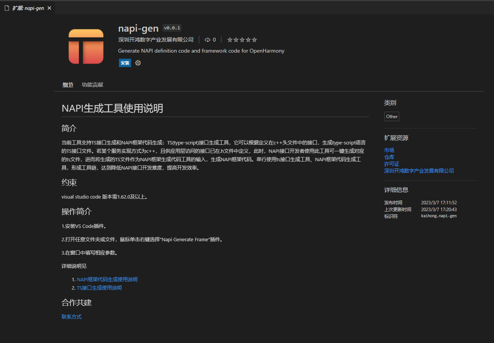
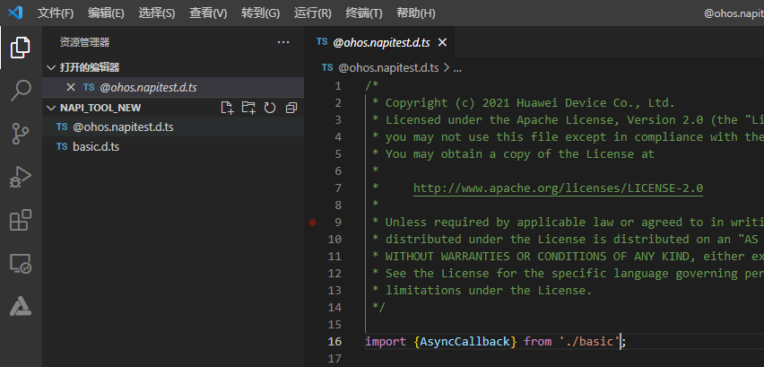

# NAPI框架生成工具使用说明
## 简介

NAPI框架生成工具支持三种入口，分别是可执行程序、VS Code插件、IntelliJ插件，使用者可以根据自己的需要选择合适的工具。可执行文件、IntelliJ插件、VS Code插件下载路径如下，选择napi_generator_outputs.zip下载。

[下载链接](http://ftp.kaihongdigi.com:5000/fsdownload/GGsW3B68u/generator_outputs)

下载文件说明如下：

	│   │   |── generator.jar           # IntelliJ插件
	│   │   |── gnapi-0.0.1.vsix        # VS Code插件
	│   │   |── napi_generator-linux    # Linux可执行程序 
	│   │   |── napi_generator-win.exe  # Windows可执行程序    
	│   │   └── napi_generator-macos    # Mac可执行程序                

## 工具介绍

通过NAPI框架生成工具，使用者可输入一个接口定义的ts文件，一键生成NAPI框架代码、业务代码框架、GN脚本等文件，并使用生成的NAPI接口及功能。NAPI框架生成工具的软件架构如下：

## 预检查

napi_generator的可执行程序方式和插件方式都具有预检查的功能，如果.d.ts文件中存在语法错误，那么执行的时候命令行会打印出错误信息，指出代码中存在错误的行号。使用效果如下：

	joey@joey-virtual-machine:~/code/napi_test$ ./napi_generator-linux -f @ohos.napitest.d.ts
	@ohos.napitest.d.ts (33,12): Identifier expected.
	@ohos.napitest.d.ts (33,13): ';' expected.
	@ohos.napitest.d.ts (33,13): An identifier or keyword cannot immediately follow a numeric literal.
	@ohos.napitest.d.ts (33,13): Cannot find name 'shutdownDevice'.
	@ohos.napitest.d.ts (33,28): Cannot find name 'reason'.
	@ohos.napitest.d.ts (33,34): ',' expected.
	@ohos.napitest.d.ts (33,36): 'string' only refers to a type, but is being used as a value here.
	@ohos.napitest.d.ts (33,43): ';' expected.
	@ohos.napitest.d.ts (33,49): Expression expected.
	
	joey@joey-virtual-machine:~/code/napi_test$ 

@ohos.napitest.d.ts (33,49)，其中括号中第一个参数含义为行号，第二个参数含义为列号。

预检查的触发方式与生成框架的入口一致，使用方法参见生成框架描述。

## 生成框架

### 可执行程序使用方法
#### Linux

1.将要转换的.d.ts文件放到任意目录下，建议放到可执行程序napi_generator-linux同级目录下，并且检查需要转换的d.ts文件中是否声明了import的d.ts文件，如果存在需要将import的d.ts文件也放入到待转换的d.ts文件相同的目录下。此处新建out文件，用于存放生成框架代码。整体目录文件如下：

	harmony@Ubuntu-64:~/napi/napi_generator_5/examples/gen$ ls
	basic.d.ts  napi_generator-linux  @ohos.napitest.d.ts  out

2.在终端中进入到之前可执行程序napi_generator-linux所在的目录，并运行napi_generator-linux。在napi_generator-linux后面要加参数-f，后面再加要对应的.d.ts文件名；然后添加参数-o，后面再加输出文件目录。若不添加参数-o，则输出文件默认存放在当前目录下。此处以添加参数-o为例，命令如下：

	harmony@Ubuntu-64:~/napi/napi_generator_5/examples/gen$ ./napi_generator-linux -f @ohos.napitest.d.ts -o out 

3.运行成功后会在out目录下生成对应的文件。例如：

	harmony@Ubuntu-64:~/napi/napi_generator_5/examples/gen$ cd out/
	harmony@Ubuntu-64:~/napi/napi_generator_5/examples/gen/out$ ls
	binding.gyp  BUILD.gn  napi_gen.log  napitest.cpp  napitest.h  napitest_middle.cpp  test.sh  x_napi_tool.cpp  x_napi_tool.h

4.此外，工具还支持指定路径下.d.ts文件转换、同一目录下多个.d.ts文件同时转换、多级模块.d.ts文件转换等场景。

1）指定路径下.d.ts文件转换（可转换路径下所有.d.ts文件）。napi_generator-linux文件存放在~/napi/napi_generator_5/examples/gen目录下，.d.ts文件存放在~/napi/napi_generator_5/examples/ts目录下，框架代码转换过程如下：

	harmony@Ubuntu-64:~/napi/napi_generator_5/examples/gen$ ./napi_generator-linux -d '../ts' -o out
	harmony@Ubuntu-64:~/napi/napi_generator_5/examples/gen$ cd out/
	harmony@Ubuntu-64:~/napi/napi_generator_5/examples/gen/out$ ls
	binding.gyp  BUILD.gn  napi_gen.log  power.cpp  power.h  power_middle.cpp  test.sh  x_napi_tool.cpp  x_napi_tool.h

2）同一目录下多个.d.ts文件同时转换。.../gen目录下存在两个.d.ts文件，分别为@ohos.napitest.d.ts和@ohos.power.d.ts，多个文件中间以“，”隔开，注意文件中namespace后的名称不可相同。框架代码转换过程如下：

	harmony@Ubuntu-64:~/napi/napi_generator_5/examples/gen$ ./napi_generator-linux -f @ohos.napitest.d.ts,@ohos.power.d.ts -o out 
	harmony@Ubuntu-64:~/napi/napi_generator_5/examples/gen$ cd out/
	harmony@Ubuntu-64:~/napi/napi_generator_5/examples/gen/out$ ls
	binding.gyp  BUILD.gn  napi_gen.log  napitest.cpp  napitest.h  napitest_middle.cpp  power.cpp  power.h  power_middle.cpp  test.sh  x_napi_tool.cpp  x_napi_tool.h

3）多级模块.d.ts文件转换。.../gen目录下存在@ohos.napi_.test.A.d.ts文件，转换过程如下：

	harmony@Ubuntu-64:~/napi/napi_generator_5/examples/gen$ ./napi_generator-linux -f @ohos.napi_.test.A.d.ts -o out
	harmony@Ubuntu-64:~/napi/napi_generator_5/examples/gen$ cd out/
	harmony@Ubuntu-64:~/napi/napi_generator_5/examples/gen/out$ ls
	binding.gyp  BUILD.gn  napi_gen.log  napitest.cpp  napitest.h  napitest_middle.cpp  test.sh  x_napi_tool.cpp  x_napi_tool.h

#### Windows

1.将要转换的.d.ts文件放到任意目录下，建议放到可执行程序napi_generator-win.exe同级目录下，并且检查需要转换的d.ts文件中是否声明了import的d.ts文件，如果存在需要将import的d.ts文件也放入到待转换的d.ts文件相同的目录下。示例如下：

1) 将@ohos.napitest.d.ts和basic.d.ts文件放在napi_generator\examples\gen目录下。例如：

2) 右键windows开始菜单，单击运行，输入cmd，单击确定。

2.在命令行中进入到之前可执行程序napi_generator-win.exe所在的目录，并运行napi_generator-win.exe，在napi_generator-win.exe后面要加参数-f，后面再加要对应的.d.ts文件名，如果不加参数-o，输出文件就默认在当前目录下。例如：

	E:\napi_tool>napi_generator-win.exe -f @ohos.napitest.d.ts

   命令行参数如下，-f是必须添加的参数，-o是可选参数，如果不加就默认当前目录。

	 -f, --filename <ARG1>         .d.ts file                                            
	 -o, --out <ARG1>              output directory ("." by default)

3.运行成功后会在当前目录下生成对应的文件。例如：

4.此外，工具还支持指定路径下.d.ts文件转换、同一目录下多个.d.ts文件同时转换、多级模块.d.ts文件转换等场景。

1）指定路径下.d.ts文件转换（可转换路径下所有.d.ts文件）。napi_generator-win.exe文件存放在E:\napi_generator\napi_generator-master\examples\gen>目录下，.d.ts文件存放在E:\demo目录下。命令执行成功后，gen目录中生成对应的文件如上图所示。框架代码转换命令如下：

	E:\napi_generator\napi_generator-master\examples\gen>napi_generator-win.exe -d "E:\demo"

2）同一目录下多个.d.ts文件同时转换。.../gen目录下存在两个.d.ts文件，分别为@ohos.napitest.d.ts和@ohos.power.d.ts，多个文件中间以“，”隔开，注意文件中namespace后的名称不可相同。框架代码转换命令如下：

	E:\napi_generator\napi_generator-master\examples\gen>napi_generator-win.exe -f @ohos.napitest.d.ts,@ohos.power.d.ts

3)多级模块.d.ts文件转换。.../gen目录下存在@ohos.napi_.test.A.d.ts文件。命令执行成功后，gen目录中成功生成对应的文件，与指定路径下.d.ts文件转换效果图一致，转换命令如下：
	
	E:\napi_generator\napi_generator-master\examples\gen>napi_generator-win.exe -f @ohos.napi_.test.A.d.ts

#### Mac
方法步骤参考windows、Linux的使用方法。

### VS Code插件使用方法
#### 说明
visual studio code 版本需1.62.0及以上。

#### 步骤

1.打开VS Code，在左侧边栏中选择插件安装。

   

2.单击上面三个点的按钮，选择从VSIX安装选项，然后选择刚才生成的gnapi-0.0.1.vsix插件文件，再单击安装。

   

3.安装完成后就会在VS Code的插件管理器中能看到gnapi这个插件了。

4.在VS Code中找到需要转换的.d.ts文件，并且检查需要转换的d.ts文件中是否声明了import的d.ts文件，如果存在需要将import的d.ts文件也放入到待转换的d.ts文件相同的目录下，例如：

5.鼠标在.d.ts上单击右键，选择“ Generate Napi Frame”选项，工具打开 Generate Napi Frame窗口。选择方式有.d.ts文件、文件夹两种方式，此处以.d.ts文件为例；选择接口文件文本框中默认填写.d.ts文件路径，此处不修改；生成框架路径文本框填写生成文件所放文件夹绝对路径；编译脚本路径文本框选填，此处不填写，然后点击ok。

6.转换成功工具右下角就会提示“Generated successfully”的信息，并且在.d.ts文件当前目录下生成对应文件，例如：

7.此外，工具还支持指定路径下.d.ts文件转换、同一目录下多个.d.ts文件同时转换、多级模块.d.ts文件转换等场景。

1）指定路径下.d.ts文件转换（可转换路径下所有.d.ts文件）。Generate Napi Frame窗口中，选择方式修改为文件夹；选择接口文件文本框中填写待转换.d.ts文件路径，此处为E:\demo；生成框架路径填写生成文件所放路径，此处为项目当前路径；编译脚本路径选填，此处不填写，然后点击ok。Generate Napi Frame窗口填写与生成文件如下图所示：

2）同一目录下多个.d.ts文件同时转换。项目中存在@ohos.napitest.d.ts和@ohos.power.d.ts两个文件，且声明了import的d.ts文件。Generate Napi Frame窗口中，选择方式修改为.d.ts文件；选择接口文件文本框中填写待转换.d.ts文件，此处为“E:\napi_tool_new\@ohos.napitest.d.ts,E:\napi_tool_new\@ohos.power.d.ts”；生成框架路径填写生成文件所放路径，此处为项目当前路径；编译脚本路径选填，此处不填写，然后点击ok。Generate Napi Frame窗口填写与生成文件如下图所示：

3)多级模块.d.ts文件转换。项目中存在@ohos.napi_.test.A.d.ts文件，Generate Napi Frame窗口中，选择方为.d.ts文件；选择接口文件文本框中填写待转换.d.ts文件，此处为“E:\napi_tool_new\@ohos.napi_.test.A.d.ts”；生成框架路径填写生成文件所放路径，此处为项目当前路径；编译脚本路径选填，此处不填写，然后点击ok。Generate Napi Frame窗口填写与生成文件如下图所示：

### IntelliJ插件使用方法

#### 依赖
系统：不限

开发工具：DevEco stdio

#### 使用指导
下载可执行程序与插件包generator.jar，下载链接如下：

[下载链接](http://ftpkaihongdigi.i234.me:5000/fsdownload/PPVcNMgVv/2022-06-13)

使用者进入上述链接中选择napi_generator_outputs.zip，下载插件包后，按照下述步骤安装使用即可：

1.新建或打开项目工程，以下以新建项目工程为例。

File->New->Create Project。

Ability Template选择Empty Ability,单击Next。

填写Project name、Save location,其他选项可不修改，单击Finish,新的工程就创建好了。

2.把需要转换的.d.ts文件放在DevEco stdio新建项目的src目录下，并且检查需要转换的d.ts文件中是否声明了import的d.ts文件，如果存在需要将import的d.ts文件也放入到待转换的d.ts文件相同的目录下。

3.安装插件，File->Settings->Plugins->Installed->Install Plugin from Disk...，选择下载的generator.jar，安装成功之后重启IDE。

4.选择.d.ts文件,右键选择 Generate Napi Frame选项，工具弹出 Generate Napi Frame弹窗。接口文件文本框填写.d.ts文件路径；生成框架路径文本框填写转换后生成文件存放文件夹路径，此处为src下新增out文件夹，生成文件存放在out中；编译脚本路径默认填写不修改，点击ok。

5.执行结束后会在目录下生成对应的文件。

6.此外，工具还支持指定路径下.d.ts文件转换、同一目录下多个.d.ts文件同时转换等场景。

1）指定路径下.d.ts文件转换（可转换路径下所有.d.ts文件）。Generate Napi Frame窗口中，接口文件文本框中填写待转换.d.ts文件路径，此处为E:\demo；生成框架路径填写生成文件所放路径，此处为E:\deveco_project\entry\src\out；编译脚本路径为E:\deveco_project\entry\src写，然后点击ok。Generate Napi Frame窗口填写与生成文件如下图所示：

2）同一目录下多个.d.ts文件同时转换。项目中存在@ohos.napitest.d.ts和@ohos.power.d.ts两个文件，且声明了import的d.ts文件。Generate Napi Frame窗口中，接口文件文本框中填写待转换.d.ts文件夹，此处为“E:\deveco_project\entry\src”；生成框架路径填写生成文件所放路径，此处为E:\deveco_project\entry\src\out；编译脚本路径为E:\deveco_project\entry\src写，然后点击ok。Generate Napi Frame窗口填写与生成文件如下图所示：

### 注意

对于ts文件中的number类型，默认转为C++ uint32_t类型，修改框架生成目录中的napitest.h类型赋值，可实现number类型到C++指定数据类型的转换。

## 集成测试
NAPI框架代码生成后，系统框架开发者进行二次开发后，即可集成到OpenHarmony编译系统，生成对应的库文件，供应用开发者调用接口。工具集成测试的具体操作步骤可以左键单击以下链接了解：

  [工具集成测试](https://gitee.com/openharmony/napi_generator/blob/master/docs/INTEGRATION_TESTING_ZH.md)

