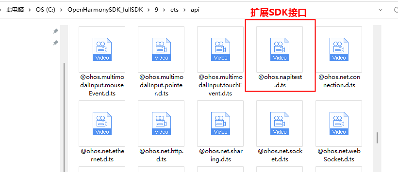

# NAPI框架生成工具集成测试

## 简介
  本文主要介绍如何将NAPI框架生成代码集成到OpenHarmony系统，进而进行集成测试。

## 准备

  1.硬件：rk3568开发套件。

  2.系统镜像：

  系统镜像的具体生成方法，可以左键单击以下链接了解：

  [生成代码集成到OpenHarmony](https://gitee.com/openharmony/napi_generator/blob/master/docs/ENSEMBLE_METHOD_ZH.md)

  3.应用hap包：hap包及源码路径如下：

```	
napi_generator/examples/app
```

  hap包的具体生成方法，可参考OpenHarmony/docs/zh-cn/application-dev文档中使用ArkTS语言开发（Stage模型）。
### 修改点1：扩展SDK接口
1. 查看SDK目录：打开DevEco Studio ，点击 Tools -> SDK Manager -> SDK 

   

2. 将@ohos.napitest.d.ts文件拷贝到应用所使用的sdk目录下 的ets\api

   

### 修改点2：增加新接口调用
其中修改index.ets文件内容如下：

[Index.ets](https://gitee.com/openharmony/napi_generator/blob/master/examples/Index.ets)

关键代码说明：

1.定义回调：

1.1 定义object回调

```
class NodeISayHelloListenerImpl {
    onSayHelloStart(info: object) {
        console.log('napiTestDemo ----onSayHelloStart', info);
        AppStorage.SetOrCreate("textInfoStart", JSON.stringify(info))
    }
    onSayHelloEnd(info: object) {
        console.log('napiTestDemo ----onSayHelloEnd.', info);
        AppStorage.SetOrCreate("textInfoEnd", JSON.stringify(info))
    }
}
let listener: NodeISayHelloListenerImpl = new NodeISayHelloListenerImpl()
```

1.2 定义register注册的回调

```
function onCallbackfunnm(wid: number) {
    AppStorage.SetOrCreate("callBackNum", JSON.stringify(wid))
    console.info("wid = " + wid)
    return "ocCallbackfuncnm";
}
```

2.注册回调：

2.1 addXXX注册object回调

```
ns.addSayHelloListener(listener);
```

2.2 registerXXX注册回调

```
ns.registerCallbackfunc(onCallbackfunnm);            
```

3.调用回调：

3.1 调用sayHello普通函数，该函数业务实现会调用注册的object回调

```
ns.sayHello("js1", "native1", napitest.SayType.kInitiative);
```

调用成功后，打印传入的参数

```
I C02e00/NAPITESTNAPILayer: [NodeISayHello.cpp:37] NAPITEST_LOGI sayHello from = js1
I C02e00/NAPITESTNAPILayer: [NodeISayHello.cpp:38] NAPITEST_LOGI sayHello to = native1
I C02e00/NAPITESTNAPILayer: [NodeISayHello.cpp:39] NAPITEST_LOGI sayHello sayType = 0
```

js层打印回调数据

```
A03d00/JSAPP: napiTestDemo ----onSayHelloStart {"from":"js1","fromId":992,"to":"native1","toId":1014,"content":"hello1","saidTime":"123456789","isEnd":false}
...
A03d00/JSAPP: napiTestDemo ----onSayHelloEnd. {"from":"native","fromId":101,"to":"js","toId":99,"content":"hello","saidTime":"987654321","isEnd":true}
```

3.2 调用sayHi普通函数，该函数业务实现会调用register注册的object回调

```
ns.sayHi("js3", "native3", napitest.SayType.kResponse);
```

调用成功后，打印传入的参数

```
I C02e00/NAPITESTNAPILayer: sayHi:81 NAPITEST_LOGI sayHi from = js3
I C02e00/NAPITESTNAPILayer: sayHi:82 NAPITEST_LOGI sayHi to = native3
I C02e00/NAPITESTNAPILayer: sayHi:83 NAPITEST_LOGI sayHi sayType = 1
```

js层打印回到数据

```
I A03d00/JSAPP: napiTestDemo ----onCallbackfunnm wid = 50
```

4.注销回调：

4.1 removeXXX注销object回调

```
ns.removeSayHelloListener(listener);
```

注销回调后再次调用sayHello方法，js层将无法再打印出回调数据

```
ns.sayHello("js2", "native2", napitest.SayType.kInitiative);
```

4.2 unRegisterXXX注销回调

```
ns.unRegisterCallbackfunc(onCallbackfunnm);
```

注销回调后再次调用sayHi方法，js层将无法再打印出回调数据

```
ns.sayHi("js4", "native4", napitest.SayType.kResponse);
```

5.调用Promise回调

```
 await ns.sayHelloWithResponse("response from", "response to", napitest.SayType.kResponse).then((ret: object) => {
     this.promiseRes = JSON.stringify(ret);
     console.info("napiTestDemo ----sayHelloWithResponse ret = " + JSON.stringify(ret));
 });
```

调用成功后，打印传入的参数

```
I C02e00/NAPITESTNAPILayer: sayHelloWithResponse:107 NAPITEST_LOGI sayHelloWithResponse from = response from
I C02e00/NAPITESTNAPILayer: sayHelloWithResponse:108 NAPITEST_LOGI sayHelloWithResponse to = response to
I C02e00/NAPITESTNAPILayer: sayHelloWithResponse:109 NAPITEST_LOGI sayHelloWithResponse sayType = 1
```

js层打印promise回调数据

```
I A03d00/JSAPP: napiTestDemo ----sayHelloWithResponse ret = {"result":0,"errMsg":"","response":""}
```

6.调用普通方法funcTest

```
this.returnVal = napitest.funcTest(false);
console.info("napiTestDemo ----funcTest returnVal = " + this.returnVal)
```

调用成功后，在js层打印返回值

```
I A03d00/JSAPP: napiTestDemo ----funcTest returnVal = "ret is false"
```

7.Text打印数据说明


```	
// 调用sayHelloWithResponse后保存promise回调数据
Text('promise回调: promiseResult = ' + this.promiseRes).margin({ top: 10 })
// 调用sayHello方法后保留addXXX注册的回调方法数据
Text('sayHelloStart回调: info = ' + this.textInfoStart).margin({ top: 10 })
Text('sayHelloEnd回调: info = ' + this.textInfoEnd).margin({ top: 10 })
// 调用sayHi方法后保留registerXXX注册的回调方法数据
Text('register注册的回调： wid = ' + this.callBackNum).margin({ top: 10 })
// 调用fucnTest方法后保存返回值
Text('普通方法funcTest返回值： returnVal = ' + this.returnVal).margin({ top: 10 })            
```

## 使用说明

步骤一：安装镜像环境：将out/rk3568/packages/phone目录下的images镜像文件下载并烧录到开发板上。

	 OpenHarmony@Ubuntu-64:~/OpenHarmony/out/rk3568/packages/phone/images$ ll
	 total 767452
	 drwxrwxrwx  2 root root       4096 Nov 21 05:32 ./
	 drwxrwxrwx 15 root root       4096 Nov 21 05:32 ../
	 -rwxrwxrwx  1 root root   67108864 Nov 21 05:04 boot_linux.img*
	 -rw-r--r--  1 root root   52428800 Nov 21 05:32 chip_prod.img
	 -rwxrwxrwx  1 root root       8569 Nov 21 05:04 config.cfg*
	 -rw-r--r--  1 root root   12582912 Nov 21 05:32 eng_system.img
	 -rwxrwxrwx  1 root root     455104 Nov 21 05:04 MiniLoaderAll.bin*
	 -rwxrwxrwx  1 root root        756 Nov 21 05:04 parameter.txt*
	 -rw-rw-r--  1 root root    2507625 Nov 21 05:32 ramdisk.img
	 -rwxrwxrwx  1 root root    5639680 Nov 21 05:04 resource.img*
	 -rw-r--r--  1 root root   52428800 Nov 21 05:32 sys_prod.img
	 -rw-r--r--  1 root root 1610608640 Nov 21 05:32 system.img
	 -rwxrwxrwx  1 root root    4194304 Nov 21 05:04 uboot.img*
	 -rw-rw-r--  1 root root   15806303 Nov 21 05:32 updater.img
	 -rw-r--r--  1 root root 1468006400 Nov 21 05:32 userdata.img
	 -rw-r--r--  1 root root  268431360 Nov 21 05:32 vendor.img

步骤二：安装hap包。

  Build Haps通过后，通过Run按钮将hap包安装到板子上。

  执行完成后，设备中会出现安装的APP。

步骤三：打印日志并验证结果。

  hap包安装成功后，进入hdc shell

  首先执行以下命令关闭hilog隐私权限

```
hilog -p off
```

  输入命令实时打印日志并输出至windows中。

	.\hdc.exe hilog > log.txt

  然后单击设备中安装的APP，进入APP后单击测试按钮，执行完成后会在hdc安装目录下出现log.txt文件。

## 查看结果

 log.txt中包含"NAPITEST_LOGI..."相关日志即为接口调用成功，如：

```
I C02e00/NAPITESTNAPILayer: [NodeISayHello.cpp:37] NAPITEST_LOGI sayHello from = js1
I C02e00/NAPITESTNAPILayer: [NodeISayHello.cpp:38] NAPITEST_LOGI sayHello to = native1
I C02e00/NAPITESTNAPILayer: [NodeISayHello.cpp:39] NAPITEST_LOGI sayHello sayType = 0
I C02e00/NAPITESTNAPILayer: [NodeISayHello.cpp:64] NAPITEST_LOGI NodeISayHelloListener_onSayHelloStartCallback begin
I C02e00/NAPITESTNAPILayer: [NodeISayHello.cpp:66] NAPITEST_LOGI NodeISayHelloListener_onSayHelloStartCallback end
...
```

点击“注册object回调后SayHello调用回调”按钮，sayHelloStart回调info和sayHelloEnd回调info会显示出C++传到js层的回调数据；

点击“注销object回调后SayHello调用回调”按钮，sayHelloStart回调info和sayHelloEnd回调info会显示出数据为空，即该回调已注销，C++无法调用回调，显示的为应用赋的空值；

点击“Promise 回调”按钮，Promise回调的errMsg, result, response会出现C++传到js层的回调数据；

点击“register回调后SayHi调用回调”按钮，register注册的回调会显示出wid = 50, wid值为C++传到js的回调数据；

点击“unRegister回调后SayHi调用回调”按钮，register注册的回调会显示出wid 为空，即该回调已注销，C++无法调用回调，显示的为应用赋的空值；

点击”调用funcTest方法“按钮，普通方法funcTest返回值显示出 returnVal = ret is false。

## 相关仓

暂无
