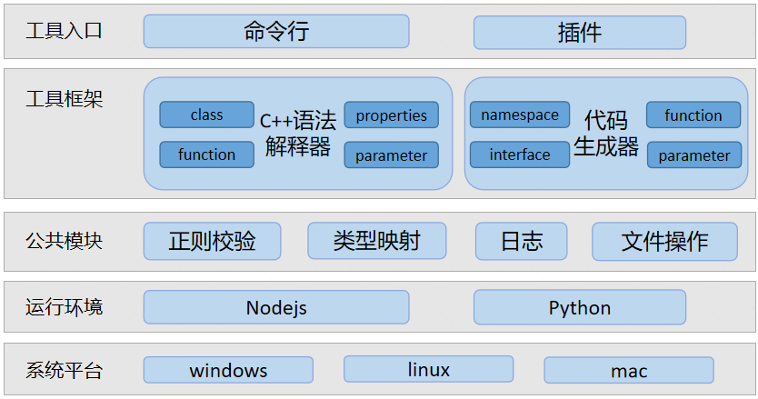

# TS接口文件生成工具开发说明

## 一、工具代码框架介绍

ts工具框架由C++语法解释器和代码生成器两部分组成。

C++语法解释器解析用户输入的.h文件内容，通过C++语法解析，将文件内容分解为类、方法、入参、成员属性等元素；

代码生成器根据从语法解析器得到的这些元素，转换为对应的typescript语法的接口、方法、参数代码，生成.ts文件。




若当前工具功能不满足开发者需求，开发者需增强工具能力，则可基于已有源码进行工具二次开发，编译打包生成自定义的可执行文件和插件。

## 二、工具开发

### 可执行文件编译说明

#### 环境说明

系统：建议Ubuntu 20.04或者Windows 10

#### 开发步骤

##### <span id="linux">Linux</span>

<span id="linux1">**1.生成napi_generator程序**</span>

1.1 安装typescript：在napi_generator/src目录下执行命令：

	npm i typescript

1.2 安装stdio：在napi_generator目录下执行命令：

	npm i stdio

1.3 安装pkg : 在napi_generator目录下执行命令：

	sudo npm i -g pkg

1.4 打包三个版本 : 执行命令：

	pkg .

执行以上步骤后，即可在napi_generator目录下生成Windows、linux、mac系统下的可执行程序:

	napi_generator-win.exe、napi_generator-linux、napi_generator-macos

1.4.1 （可选步骤） 根据需求打包指定系统下的可执行文件。若想只打包windows系统下可执行文件，可执行命令：

	pkg -t node14-win . -o napi_generator-win.exe

若想只打包linux系统下可执行文件，可执行命令：

	pkg -t node14-linux . -o napi_generator-linux

若想只打包macos系统下可执行文件，可执行命令：

	pkg -t node14-macos . -o napi_generator-macos

备注：参数-t为指定系统，参数-o为指定可执行文件名称。

**2 生成header_parser程序**

2.1 安装python库 CppHeaderParser

```
sudo pip install CppHeaderParser
```

2.2 安装 pyinstaller

```
sudo pip install pyinstaller
```

2.3 将python脚本打包成独立可执行文件
进入 napi_generator/src/tsGen 目录后执行如下命令：

```
sudo pyinstaller -F header_parser.py
```

打包后的可执行文件在dist目录中
./src/tsGen/dist/header_parser

**3.运行程序**

将打包生成的napi_generator-linux和header_parser程序放在同一个目录中，执行如下命令即可生成ts文件

```
./napi_generator-linux -f xxx.h
```


##### Mac

**1.生成napi_generator-macos程序**

napi_generator-macos程序可以在Linux环境下生成，见开发步骤 **Linux** - [**1.生成napi_generator程序**](#Linux1) 章节：

也可按该章节的命令步骤，在MacOS系统中依次执行生成。

**2.生成header_parser程序**

header_parser程序必须在MacOS系统中生成。
2.1 安装python库 CppHeaderParser

```
sudo pip install CppHeaderParser
```

2.2 安装 pyinstaller

```
sudo pip install pyinstaller
```

2.3 将python脚本打包成独立可执行文件
进入 napi_generator/src/tsGen 目录后执行如下命令：

```
sudo pyinstaller -F header_parser.py
```

打包后的可执行文件在dist目录中
./src/tsGen/dist/header_parser

**3.运行程序**

将打包生成的napi_generator-macos和header_parser程序放在同一个目录中，执行如下命令即可生成ts文件

```
./napi_generator-linux -f xxx.h
```


##### Windows

**1.生成napi_generator程序**

1.1 安装typescript：使用管理员身份在napi_generator/src目录下执行命令：

	npm i typescript

1.2 安装stdio：使用管理员身份在napi_generator目录下执行命令：

	npm i stdio

1.3 安装pkg : 使用管理员身份在napi_generator目录下执行命令：

	npm i -g pkg

1.4 打包三个版本 : 使用管理员身份执行命令：

	pkg .

执行以上步骤后，即可在napi_generator目录下生成Windows、linux、mac系统下的可执行程序:

	napi_generator-win.exe、napi_generator-linux、napi_generator-macos

1.4.1（可选步骤）根据需求打包指定系统下的可执行文件。若想只打包windows系统下可执行文件，可执行命令：

	pkg -t node14-win . -o napi_generator-win.exe

若想只打包linux系统下可执行文件，可执行命令：

	pkg -t node14-linux . -o napi_generator-linux

若想只打包macos系统下可执行文件，可执行命令：

	pkg -t node14-macos . -o napi_generator-macos

**2.生成header_parser程序**

2.1 安装python库 CppHeaderParser

```
pip install CppHeaderParser
```

2.2 安装 pyinstaller

```
pip install pyinstaller
```

2.3 将python脚本打包成独立可执行文件
进入 napi_generator/src/tsGen 目录后执行如下命令：

```
pyinstaller -F header_parser.py
```

打包后的可执行文件header_parser.exe在dist目录中
./src/tsGen/dist/header_parser.exe

**3.运行程序**

将打包生成的napi_generator-win.exe和header_parser.exe程序放在同一个目录中，执行如下命令即可生成ts文件

```
napi_generator-win.exe -f xxx.h
```
