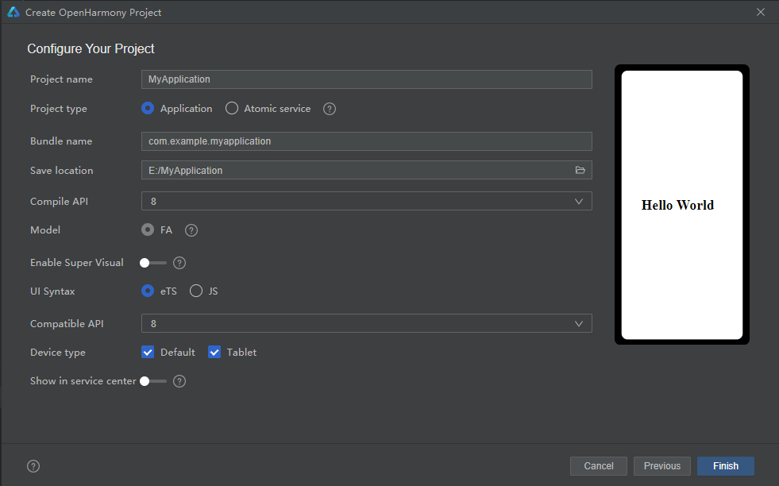
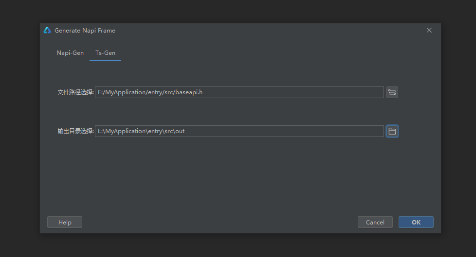

# Ts接口生成工具IntelliJ插件使用说明

## 简介

IntelliJ插件下载路径如下，选择napi_generator_outputs.zip中generator.jar下载。

[下载链接](http://ftp.kaihongdigi.com:5000/fsdownload/mKjfCmPjk/generator_outputs_NAPI_0930)               

## IntelliJ插件使用方法

### 依赖

系统：不限

开发工具：DevEco stdio

### 使用指导

1.新建或打开项目工程，以下以新建项目工程为例。

File->New->Create Project。

Ability Template选择Empty Ability,单击Next。

填写Project name、Save location,其他选项可不修改，单击Finish,新的工程就创建好了。

2.安装插件，File->Settings->Plugins->Installed->Install Plugin from Disk...，选择下载的generator.jar，安装成功之后重启IDE。

3.把需要转换的.h文件放在DevEco stdio新建项目的src目录下。

4.选择.h文件,点击右键选择Generate Napi Frame，工具弹出Generate Napi Frame弹窗,选择Ts-Gen页签。文件路径文本框填写.h文件路径；输出目录选择文本框填写生成.d.ts文件存放路径，点击ok。

5.执行结束后会在out目录下生成.d.ts代码文件。
