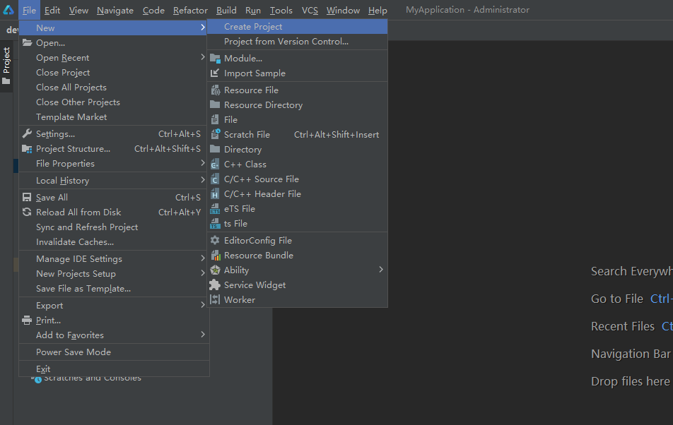
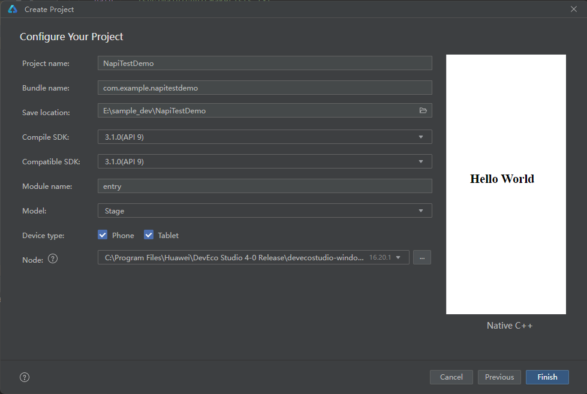
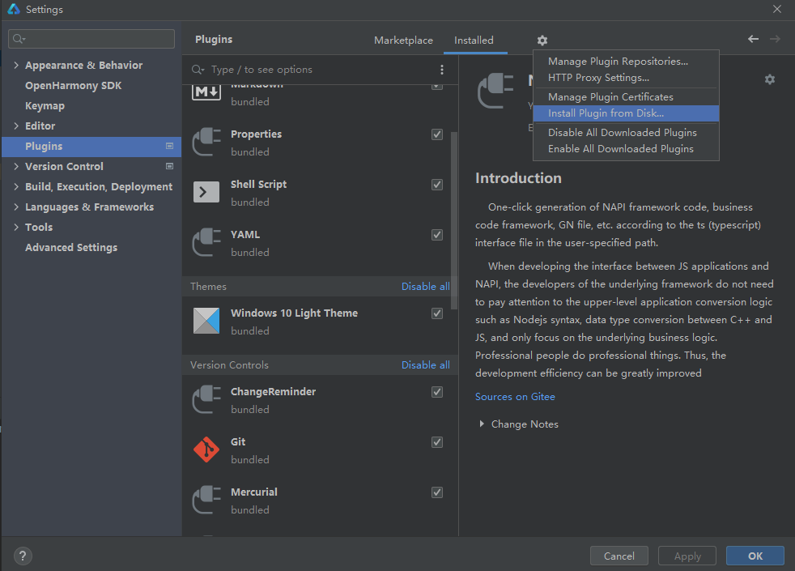
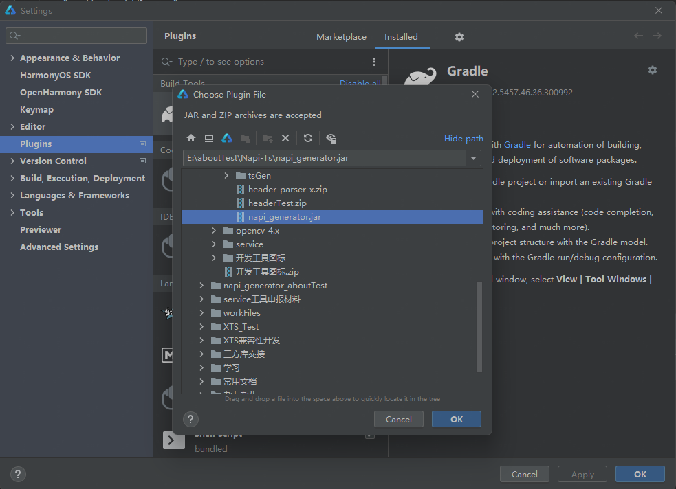
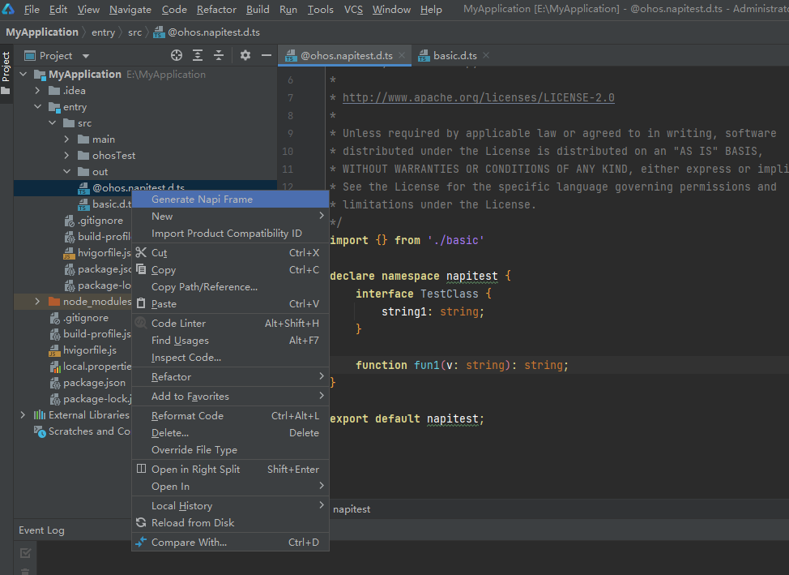

# NAPI框架生成工具IntelliJ插件使用说明

## 简介

IntelliJ插件下载路径如下，选择napi_generator_outputs.zip中generator.jar下载。

[下载链接](http://ftp.kaihongdigi.com:5000/fsdownload/GGsW3B68u/generator_outputs)               

## IntelliJ插件使用方法

### 依赖

系统：不限

开发工具：DevEco stdio

### 使用指导

1.新建或打开项目工程，以下以新建项目工程为例。

File->New->Create Project。

Ability Template选择Empty Ability,单击Next。

填写Project name、Save location,其他选项可不修改，单击Finish,新的工程就创建好了。

2.把需要转换的.d.ts文件放在DevEco stdio新建项目的src目录下，并且检查需要转换的d.ts文件中是否声明了import的d.ts文件，如果存在需要将import的d.ts文件也放入到待转换的d.ts文件相同的目录下。

3.安装插件，File->Settings->Plugins->Installed->Install Plugin from Disk...，选择下载的generator.jar，安装成功之后重启IDE。

4.选择.d.ts文件,右键选择 Generate Napi Frame选项，工具弹出Generate Napi Frame弹窗。接口文件文本框填写.d.ts文件路径；生成框架路径文本框填写转换后生成文件存放文件夹路径，此处为src下新增out文件夹，生成文件存放在out中；编译脚本路径默认填写不修改，点击ok。

5.执行结束后会在目录下生成对应的文件。

6.此外工具还支持指定路径下d.ts文件转换、同一目录下多个d.ts文件同时转换、多级模块d.ts文件转换、d.ts接口import多个文件等场景。

1）指定路径下.d.ts文件转换（可转换路径下所有.d.ts文件）。Generate Napi Frame窗口填写与生成文件如下图所示：

2）同一目录下多个.d.ts文件同时转换。项目中存在@ohos.napitest.d.ts和@ohos.power.d.ts两个文件，且声明了import的d.ts文件。Generate Napi Frame窗口填写与生成文件如下图所示：

3）将待转换的d.ts文件与被引用的d.ts文件放在同一目录下，basic.d.ts文件放在待转换的d.ts文件上一级目录下。Generate Napi Frame窗口中选中启用import功能，其他选项填写参考以上步骤，点击ok。Generate Napi Frame窗口填写与生成文件如下图所示：

## 注意

对于ts文件中的number类型，默认转为C++ uint32_t类型，修改框架生成目录中的napitest.h类型赋值，可实现number类型到C++指定数据类型的转换。

## 集成测试
NAPI框架代码生成后，系统框架开发者进行二次开发后，即可集成到OpenHarmony编译系统，生成对应的库文件，供应用开发者调用接口。工具集成测试的具体操作步骤可以左键单击以下链接了解：

[工具集成测试](https://gitee.com/openharmony/napi_generator/blob/master/docs/INTEGRATION_TESTING_ZH.md)

