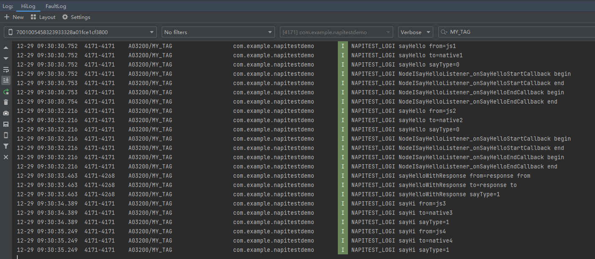

# DevEco Studio编译打包说明

## 简介
  本文主要介绍使用IntelliJ插件将ts接口文件名格式如下ohos.A.B.C.d.ts文件转换后如何在DevEco Studio进行编译打包。

## 准备

### 待转换的ts文件用例

待转换的@ohos.napitest.d.ts文件如下：

[@ohos.napitest.d.ts](https://gitee.com/openharmony/napi_generator/blob/master/examples/ts/@ohos.napitest.d.ts)

### 业务代码用例

业务代码用例如下：

serviceCode/NodeISayHello.h

[NodeISayHello.h](https://gitee.com/openharmony/napi_generator/blob/master/examples/pluginCase/serviceCode/NodeISayHello.h)

serviceCode/NodeISayHello.cpp

[NodeISayHello.cpp](https://gitee.com/openharmony/napi_generator/blob/master/examples/pluginCase/serviceCode/NodeISayHello.cpp)

### 测试应用用例

在DevEco Studio中增加调用napi方法的测试用例。其中修改index.js文件内容如下：

[Index.ets](https://gitee.com/openharmony/napi_generator/blob/master/examples/pluginCase/Index.ets)

1.定义回调：

1.1 定义object回调

```
class NodeISayHelloListenerImpl {
    onSayHelloStart(info: object) {
        console.log('napiTestDemo ----onSayHelloStart', info);
        AppStorage.SetOrCreate("textInfoStart", JSON.stringify(info))
    }
    onSayHelloEnd(info: object) {
        console.log('napiTestDemo ----onSayHelloEnd.', info);
        AppStorage.SetOrCreate("textInfoEnd", JSON.stringify(info))
    }
}
let listener: NodeISayHelloListenerImpl = new NodeISayHelloListenerImpl()
```

1.2 定义register注册的回调

```
function onCallbackfunnm(wid: number) {
    AppStorage.SetOrCreate("callBackNum", JSON.stringify(wid))
    console.info("wid = " + wid)
    return "ocCallbackfuncnm";
}
```

2.注册回调：

2.1 addXXX注册object回调

```
ns.addSayHelloListener(listener);
```

2.2 registerXXX注册回调

```
ns.registerCallbackfunc(onCallbackfunnm);            
```

3.调用回调：

3.1 调用sayHello普通函数，该函数业务实现会调用注册的object回调

```
ns.sayHello("js1", "native1", napitest.SayType.kInitiative);
```

调用成功后，DevEco中HiLog打印传入的参数

```
A03200/MY_TAG    com.example.napitestdemo    I  NAPITEST_LOGI sayHello from=js1
A03200/MY_TAG    com.example.napitestdemo    I  NAPITEST_LOGI sayHello to=native1
A03200/MY_TAG    com.example.napitestdemo    I  NAPITEST_LOGI sayHello sayType=0
```

js层打印回调数据

```
A03d00/JSAPP: napiTestDemo ----onSayHelloStart {"from":"js1","fromId":992,"to":"native1","toId":1014,"content":"hello1","saidTime":"123456789","isEnd":false}
...
A03d00/JSAPP: napiTestDemo ----onSayHelloEnd. {"from":"native","fromId":101,"to":"js","toId":99,"content":"hello","saidTime":"987654321","isEnd":true}
```

3.2 调用sayHi普通函数，该函数业务实现会调用register注册的object回调

```
ns.sayHi("js3", "native3", napitest.SayType.kResponse);
```

调用成功后，DevEco中HiLog打印传入的参数

```
A03200/MY_TAG    com.example.napitestdemo    I  NAPITEST_LOGI sayHi from=js3
A03200/MY_TAG    com.example.napitestdemo    I  NAPITEST_LOGI sayHi to=native3
A03200/MY_TAG    com.example.napitestdemo    I  NAPITEST_LOGI sayHi sayType=1
```

js层打印回到数据

```
I A03d00/JSAPP: napiTestDemo ----onCallbackfunnm wid = 50
```

4.注销回调：

4.1 removeXXX注销object回调

```
ns.removeSayHelloListener(listener);
```

注销回调后再次调用sayHello方法，js层将无法再打印出回调数据

```
ns.sayHello("js2", "native2", napitest.SayType.kInitiative);
```

4.2 unRegisterXXX注销回调

```
ns.unRegisterCallbackfunc(onCallbackfunnm);
```

注销回调后再次调用sayHi方法，js层将无法再打印出回调数据

```
ns.sayHi("js4", "native4", napitest.SayType.kResponse);
```

5.调用Promise回调

```
 await ns.sayHelloWithResponse("response from", "response to", napitest.SayType.kResponse).then((ret: object) => {
     this.promiseRes = JSON.stringify(ret);
     console.info("napiTestDemo ----sayHelloWithResponse ret = " + JSON.stringify(ret));
 });
```

调用成功后，DevEco中HiLog打印传入的参数

```
A03200/MY_TAG    com.example.napitestdemo    I  NAPITEST_LOGI sayHelloWithResponse from=response from
A03200/MY_TAG    com.example.napitestdemo    I  NAPITEST_LOGI sayHelloWithResponse to=response to
A03200/MY_TAG    com.example.napitestdemo    I  NAPITEST_LOGI sayHelloWithResponse sayType=1
```

js层打印promise回调数据

```
I A03d00/JSAPP: napiTestDemo ----sayHelloWithResponse ret = {"result":0,"errMsg":"","response":""}
```

6.调用普通方法funcTest

```
this.returnVal = napitest.funcTest(false);
console.info("napiTestDemo ----funcTest returnVal = " + this.returnVal)
```

调用成功后，在js层打印返回值

```
I A03d00/JSAPP: napiTestDemo ----funcTest returnVal = "ret is false"
```

7.调用其他模块：entry模块的方法add

```
this.addResult = testEntry.add(2, 3).toString();
console.info("napiTestDemo ----add addResult = " + this.addResult)
```

调用成功后，在js层打印返回值

```
I A03d00/JSAPP: napiTestDemo ----add addResult = 5
```

8.Text打印数据说明


```	
// 调用工具模块napitest中的sayHelloWithResponse后保存promise回调数据
Text('promise回调: promiseResult = ' + this.promiseRes).margin({ top: 10 })
// 调用工具模块napitest中的sayHello方法后保留addXXX注册的回调方法数据
Text('sayHelloStart回调: info = ' + this.textInfoStart).margin({ top: 10 })
Text('sayHelloEnd回调: info = ' + this.textInfoEnd).margin({ top: 10 })
// 调用工具模块napitest中的sayHi方法后保留registerXXX注册的回调方法数据
Text('register注册的回调： wid = ' + this.callBackNum).margin({ top: 10 })
// 调用工具模块napitest中的fucnTest方法后保存返回值
Text('普通方法funcTest返回值： returnVal = ' + this.returnVal).margin({ top: 10 })
// 调用其他模块entry中的add方法后保存返回值
Text('libentry模块: 2 + 3 = ' + this.addResult).margin({ top: 10 })
```

## 使用说明

1. 在File->Project Structure->Project->Signing Configs自动签名，点击OK即可。

   

2. 连接设备，并点击右上角三角符号编译打包。

    1.0.3版本的build-profile.json5文件去掉了"externalNativeOptions"中的abiFilters"字段，该字段含义是指定编译的版本；默认打包可能会编译x86,arm64,arm32三个版本的.so文件，都在hap包里会比较大，指定这个就只打arm64和arm32，若用户想过滤版本，可自行增加该字段

    ```
    "abiFilters": ["armeabi-v7a", "arm64-v8a"]
    ```

    

3. 执行成功后，设备中会出现安装的APP并进入APP测试页面

    点击"注册object回调后SayHello调用回调"按钮，APP页面中sayHelloStart回调info和sayHelloEnd回调info会显示出C++传到js层的回调数据；DevEco Studio控制台中Log->HiLog中会出现以下结果:

    ```
    A03200/MY_TAG    com.example.napitestdemo    I  NAPITEST_LOGI sayHello from=js1
    A03200/MY_TAG    com.example.napitestdemo    I  NAPITEST_LOGI sayHello to=native1
    A03200/MY_TAG    com.example.napitestdemo    I  NAPITEST_LOGI sayHello sayType=0
    A03200/MY_TAG    com.example.napitestdemo    I  NAPITEST_LOGI NodeISayHelloListener_onSayHelloStartCallback begin
    A03200/MY_TAG    com.example.napitestdemo    I  NAPITEST_LOGI NodeISayHelloListener_onSayHelloStartCallback end
    A03200/MY_TAG    com.example.napitestdemo    I  NAPITEST_LOGI NodeISayHelloListener_onSayHelloEndCallback begin
    A03200/MY_TAG    com.example.napitestdemo    I  NAPITEST_LOGI NodeISayHelloListener_onSayHelloEndCallback end
    ```

    点击“注销object回调后SayHello调用回调”按钮，sayHelloStart回调info和sayHelloEnd回调info会显示出数据为空，即该回调已注销，C++无法调用回调，显示的为应用赋的空值；DevEco Studio控制台中Log->HiLog中会出现以下结果:

    ```
    A03200/MY_TAG    com.example.napitestdemo    I  NAPITEST_LOGI sayHello from=js2
    A03200/MY_TAG    com.example.napitestdemo    I  NAPITEST_LOGI sayHello to=native2
    A03200/MY_TAG    com.example.napitestdemo    I  NAPITEST_LOGI sayHello sayType=0
    A03200/MY_TAG    com.example.napitestdemo    I  NAPITEST_LOGI NodeISayHelloListener_onSayHelloStartCallback begin
    A03200/MY_TAG    com.example.napitestdemo    I  NAPITEST_LOGI NodeISayHelloListener_onSayHelloStartCallback end
    A03200/MY_TAG    com.example.napitestdemo    I  NAPITEST_LOGI NodeISayHelloListener_onSayHelloEndCallback begin
    A03200/MY_TAG    com.example.napitestdemo    I  NAPITEST_LOGI NodeISayHelloListener_onSayHelloEndCallback end
    ```

    点击“Promise 回调”按钮，Promise回调的errMsg, result, response会出现C++传到js层的回调数据；DevEco Studio控制台中Log->HiLog中会出现以下结果:

    ```
    A03200/MY_TAG    com.example.napitestdemo    I  NAPITEST_LOGI sayHelloWithResponse from=response from
    A03200/MY_TAG    com.example.napitestdemo    I  NAPITEST_LOGI sayHelloWithResponse to=response to
    A03200/MY_TAG    com.example.napitestdemo    I  NAPITEST_LOGI sayHelloWithResponse sayType=1
    ```

    点击“register回调后SayHi调用回调”按钮，register注册的回调会显示出wid = 50, wid值为C++传到js的回调数据；DevEco Studio控制台中Log->HiLog中会出现以下结果:

    ```
    A03200/MY_TAG    com.example.napitestdemo    I  NAPITEST_LOGI sayHi from=js3
    A03200/MY_TAG    com.example.napitestdemo    I  NAPITEST_LOGI sayHi to=native3
    A03200/MY_TAG    com.example.napitestdemo    I  NAPITEST_LOGI sayHi sayType=1
    ```

    点击“unRegister回调后SayHi调用回调”按钮，register注册的回调会显示出wid 为空，即该回调已注销，C++无法调用回调，显示的为应用赋的空值；DevEco Studio控制台中Log->HiLog中会出现以下结果:

    ```
    A03200/MY_TAG    com.example.napitestdemo    I  NAPITEST_LOGI sayHi from=js4
    A03200/MY_TAG    com.example.napitestdemo    I  NAPITEST_LOGI sayHi to=native4
    A03200/MY_TAG    com.example.napitestdemo    I  NAPITEST_LOGI sayHi sayType=1
    ```

    点击”调用funcTest方法“按钮，普通方法funcTest返回值显示出 returnVal = ret is false。

    点击“调用entry模块的方法”按钮，libentry模块：2 + 3 = 5。

    

## 相关仓

暂无
