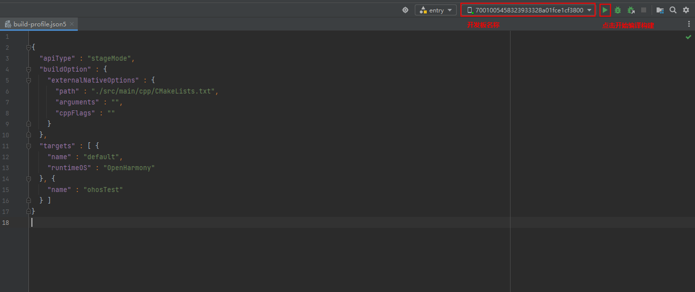

# DevEco Studio编译打包说明

## 简介
  本文主要介绍使用IntelliJ插件将ts接口文件名格式如下ohos.A.B.C.d.ts文件转换后如何在DevEco Studio进行编译打包。

## 准备

1. 待转换的@napitest.test.d.ts文件如下：

```
declare namespace napitest {
    function fun1(v1: number): number;
}

export default napitest;
```

2. 生成的napitest.cpp给out赋初值：

```
out = 23;
```

3. 生成的CmakeLists.txt中引入hilog库libhilog_ndk.z.so：

```
target_link_libraries(test PUBLIC libace_napi.z.so libuv.so libhilog_ndk.z.so)
```

4. 在生成的napitest_middle.cpp中打印hilog日志：

```
#include "hilog/log.h"
// LOG
static unsigned int logDomain = 0xD001234;
static const char* APP_TAG = "napitest";
#define MYAPP_LOGERR(type, ...) ((void)OH_LOG_Print((type), LOG_ERROR, logDomain, APP_TAG, __VA_ARGS__));

...

//在需要的地方打印日志
MYAPP_LOGERR(LOG_APP, "==========test fun1_middle begin==========");
...
MYAPP_LOGERR(LOG_APP, "----------test fun1_middle result = %{public}d ----------", vio->out);
...
MYAPP_LOGERR(LOG_APP, "==========test fun1_middle end==========");
```

5. 在DevEco Studio中增加调用napi方法的测试用例。其中修改index.js文件内容如下：


```	
import router from '@ohos.router';
import napitest from 'libtest.so';
export default {
    data: {
        title: ""
    },
    onInit(){
        this.title = this.$t('strings.world');
    },
    onclick: function () {
        router.push({
            url: "pages/index/index.js"
        })
    },
    ontest: function () {
        console.log("napitest  begin AAAAAAAAAAAAAAAAAA")
        let testNum = napitest.fun1(1);
        console.info("napitest testNum = " + testNum);
        console.log("napitest  end AAAAAAAAAAAAAAAAAA")
    }
}
```
  修改index.html文件内容如下：

```
    <!--index.hml-->
	<div class="container">
    	<text class="title">
        	Hello World
    	</text>
	<!-- 添加按钮，值为Next，并绑定onclick方法-->
    	<input class="btn" type="button" value="Next" onclick="onclick"></input>
    	<input class="btn" type="button" value="napitest" onclick="ontest"></input>
	</div>
```

## 使用说明

1. 在File->Project Structure->Project->Signing Configs自动签名，点击OK即可。

   

2. 连接设备，并点击右上角三角符号编译打包。

    

4. 执行成功后，设备中会出现安装的APP并进入APP测试页面，点击测试按钮DevEco Studio控制台中Log->OpenLog中会出现以下结果：

    ```
    01-01 04:34:40.862 5993-6003/com.example.myapplication D 03b00/JSApp: app Log: napitest  begin AAAAAAAAAAAAAAAAAA
    01-01 04:34:40.862 5993-6003/com.example.myapplication E 01234/napi: ==========test fun1_middle begin==========
    01-01 04:34:40.862 5993-6003/com.example.myapplication E 01234/napi: ----------test fun1_middle result = 23 ----------
    01-01 04:34:40.862 5993-6003/com.example.myapplication E 01234/napi: ==========test fun1_middle end==========
    01-01 04:34:40.862 5993-6003/com.example.myapplication I 03b00/JSApp: app Log: napitest testNum = 23
    01-01 04:34:40.862 5993-6003/com.example.myapplication D 03b00/JSApp: app Log: napitest  end AAAAAAAAAAAAAAAAAA
    01-01 04:35:26.914 370-890/foundation D 01120/BundleMgrService: [inner_bundle_info.cpp(GetBundleWithAbilities):1733] bundleName:com.example.callbacktest userid:100
    ```
    
    

## 相关仓

暂无
