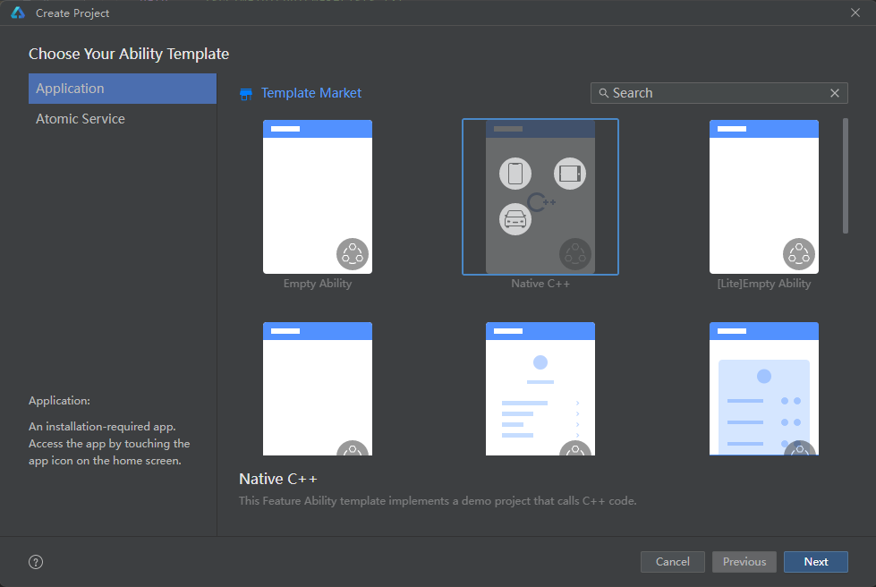
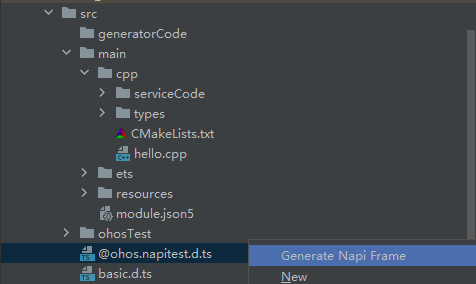
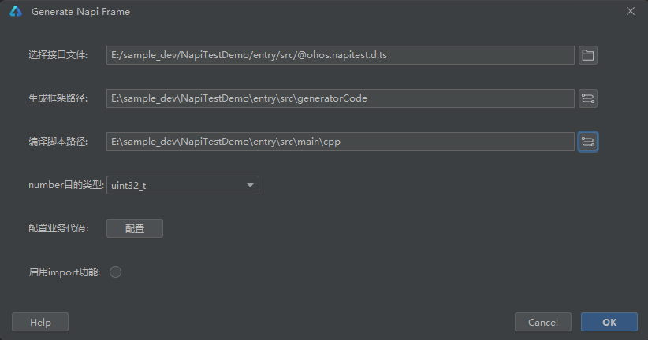

# NAPI框架生成工具IntelliJ插件使用说明

## 简介

IntelliJ插件下载路径如下，选择napi_generator.jar下载。

[下载链接1]( http://ftpkaihongdigi.i234.me:5000/sharing/PC6uOorrM)

[下载链接2]( http://ftp.kaihong.com:5000/sharing/PC6uOorrM)

[下载链接3]( http://ftp.kaihongdigi.com:5000/sharing/PC6uOorrM)    

## IntelliJ插件使用方法

### 依赖

系统：建议Windows 10

开发工具：DevEco Studio

### 使用指导

1.新建或打开项目工程，以下以新建项目工程为例。

File->New->Create Project。

Ability Template选择Empty Ability,单击Next。

填写Project name、Save location,其它选项可不修改，单击Finish,新的工程就创建好了。

2.安装插件，File->Settings->Plugins->Installed->Install Plugin from Disk...，选择下载的generator.jar，安装成功之后重启IDE。

3.把待转换的.d.ts文件放在DevEco stdio新建项目的src目录下。若.d.ts文件中声明了basic.d.ts文件，将basic.d.ts文件放置在待转换.d.ts文件上一级目录；若除此之外还声明其它.d.ts文件，将此类文件放置在待转换.d.ts文件同级目录。

4.选择.d.ts文件,点击右键选择 Generate Napi Frame，工具弹出Generate Napi Frame弹窗，选择Napi-Gen页签。接口文件文本框填写.d.ts文件路径；生成框架路径文本框填写生成框架存放路径；编译脚本路径填写生成CMakeList.txt文件输出路径；number目的类型此处选择char；启用import功能不选择（待转换.d.ts文件未引用其它文件）；点击ok。

5.执行结束后会在out目录下生成napi框架代码文件。

## DevEco Studio编译打包说明
NAPI框架代码生成后，系统框架开发者进行二次开发后，可在DevEco Studio进行编译打包生成对应的库文件，供应用开发者调用接口。DevEco Studio编译打包说明的具体操作步骤可以左键单击以下链接了解：

[DevEco Studio编译打包说明](https://gitee.com/openharmony/napi_generator/blob/master/docs/napi/INSTRUCTION_BUILD_ZH.md)

