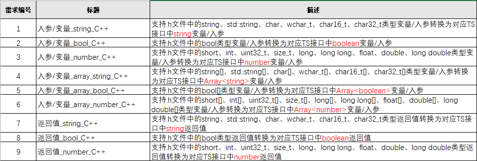

# NAPI框架生成工具VSCode插件使用说明
## 简介

VS Code插件下载路径如下，选择napi_generator_outputs.zip中gnapi-0.0.1.vsix下载。

[下载链接](http://ftp.kaihongdigi.com:5000/fsdownload/GGsW3B68u/generator_outputs)               

## VS Code插件使用方法

### 说明

visual studio code 版本需1.62.0及以上。

### 步骤

1.打开VS Code，在左侧边栏中选择插件安装。

2.单击上面三个点的按钮，选择从VSIX安装选项，然后选择刚才生成的gnapi-0.0.1.vsix插件文件，再单击安装。

3.安装完成后就会在VS Code的插件管理器中能看到gnapi这个插件了。

4.在VS Code中找到需要转换的.d.ts文件，并且检查需要转换的d.ts文件中是否声明了import的d.ts文件，如果存在需要将import的d.ts文件也放入到待转换的d.ts文件相同的目录下，例如：

5.鼠标在.d.ts上单击右键，选择“ Generate Napi Frame”选项，工具打开 Generate Napi Frame窗口。选择方式有.d.ts文件、文件夹两种方式，此处以.d.ts文件为例；选择接口文件文本框中默认填写.d.ts文件路径，此处不修改；生成框架路径文本框填写生成文件所放文件夹绝对路径；编译脚本路径文本框选填，此处不填写，然后点击ok。

6.转换成功工具右下角就会提示“Generated successfully”的信息，并且在.d.ts文件当前目录下生成对应文件，例如：

7.此外，工具还支持指定路径下.d.ts文件转换、同一目录下多个.d.ts文件同时转换、多级模块.d.ts文件转换等场景。

1）指定路径下.d.ts文件转换（可转换路径下所有.d.ts文件）。Generate Napi Frame窗口中，选择方式修改为文件夹；选择接口文件文本框中填写待转换.d.ts文件路径，此处为E:\demo；生成框架路径填写生成文件所放路径，此处为项目当前路径；编译脚本路径选填，此处不填写，然后点击ok。Generate Napi Frame窗口填写与生成文件如下图所示：

2）同一目录下多个.d.ts文件同时转换。项目中存在@ohos.napitest.d.ts和@ohos.power.d.ts两个文件，且声明了import的d.ts文件。Generate Napi Frame窗口中，选择方式修改为.d.ts文件；选择接口文件文本框中填写待转换.d.ts文件，此处为“E:\napi_tool_new\@ohos.napitest.d.ts,E:\napi_tool_new\@ohos.power.d.ts”；生成框架路径填写生成文件所放路径，此处为项目当前路径；编译脚本路径选填，此处不填写，然后点击ok。Generate Napi Frame窗口填写与生成文件如下图所示：

3)多级模块.d.ts文件转换。项目中存在@ohos.napi_.test.A.d.ts文件，Generate Napi Frame窗口中，选择方为.d.ts文件；选择接口文件文本框中填写待转换.d.ts文件，此处为“E:\napi_tool_new\@ohos.napi_.test.A.d.ts”；生成框架路径填写生成文件所放路径，此处为项目当前路径；编译脚本路径选填，此处不填写，然后点击ok。Generate Napi Frame窗口填写与生成文件如下图所示：

## 注意

对于ts文件中的number类型，默认转为C++ uint32_t类型，修改框架生成目录中的napitest.h类型赋值，可实现number类型到C++指定数据类型的转换。

## 集成测试
NAPI框架代码生成后，系统框架开发者进行二次开发后，即可集成到OpenHarmony编译系统，生成对应的库文件，供应用开发者调用接口。工具集成测试的具体操作步骤可以左键单击以下链接了解：

  [工具集成测试](https://gitee.com/openharmony/napi_generator/blob/master/docs/INTEGRATION_TESTING_ZH.md)

