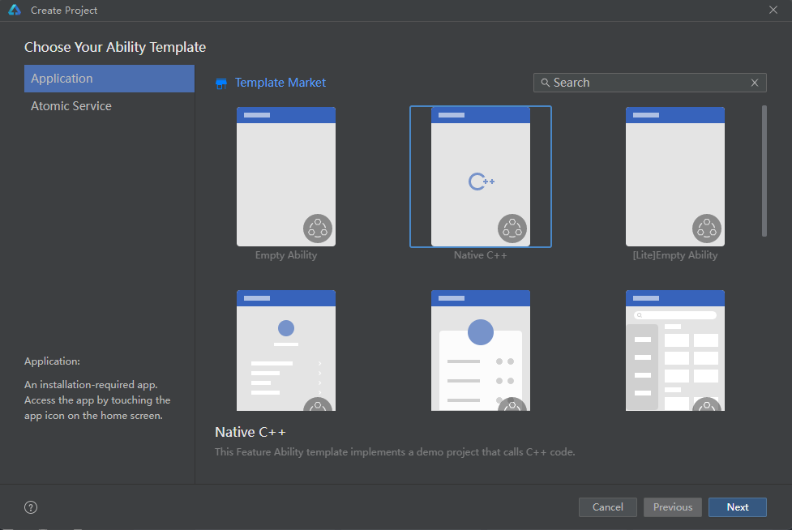
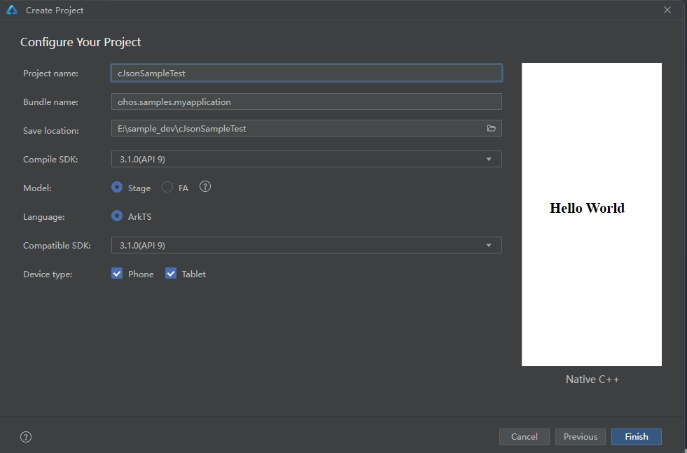
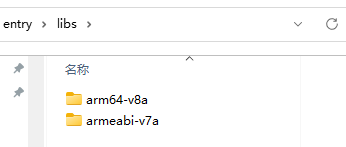
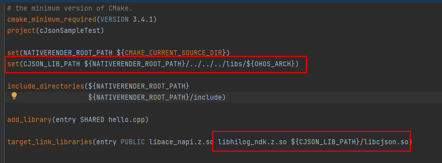
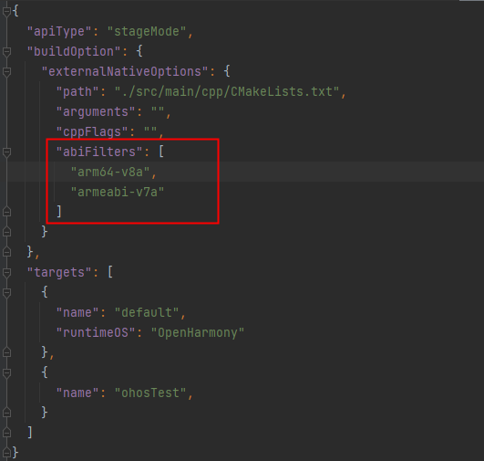
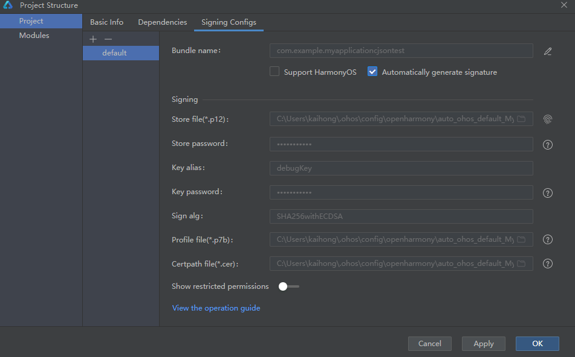

# Native生成工具使用说明

## 准备

### 依赖

系统：建议Windows 10

开发工具：DevEco Studio

## 生成框架

### 创建工程

1.打开 DevEco Studio：

选择Create Project -> Application -> Native C++ ，然后点击Next，将Project name修改为cJsonSampleTest，点击Finish，则工程创建成功。





### 导入三方库

将待转换的三方库导入工程中，如将cJSON三方库导入工程：

1.cJSON三方库获取：[测试用三方库](https://gitee.com/openharmony/napi_generator/releases/tag/测试用资源)  选择cJSON.zip下载


2.将三方库导入工程：将cJSON.zip解压，解压后可以拷贝内容进  cJsonSampleTest\entry\src\main\cpp\thirdparty 和 cJsonSampleTest\entry\libs 下



同时将arm64-v8a/lib下的所有.so文件拷贝一份至arm64-v8a下，将armeabi-v7a/lib下的所有.so文件拷贝一份至armeabi-v7a下。

3.将libcjson加入编译：在CMakeLists.txt（cJsonSampleTest/entry/src/main/cpp/CMakeLists.txt）中加入libcjson路径

```
set(CJSON_LIB_PATH ${NATIVERENDER_ROOT_PATH}/../../../libs/${OHOS_ARCH})
```

在target_link_libraries中加入hilog和libcjson.so:

```
libhilog_ndk.z.so
```

```
${CJSON_LIB_PATH}/libcjson.so
```



4.修改编译选项：在cJsonSampleTest/entry/build-profile.json5文件中buildOption中增加abiFilters字段， 并将targets字段的runtimeOS改为OpenHarmony

```
"abiFilters": [
        "arm64-v8a",
        "armeabi-v7a"
      ]
```

```
"runtimeOS": "OpenHarmony"
```



### 使用nativetool生成框架

#### 准备

##### 1.在本地新建文件夹nativetoolGen

##### **2.下载native_gen-win.exe**, header_parser.exe

下载  native_gen-win.exe 可执行程序和 header_parser.exe 可执行程序：[下载生成工具 ](https://gitee.com/openharmony/napi_generator/releases/tag/生成工具) ；选择 tool.rar下载并解压，将解压后的文件拷贝到nativetoolGen目录下


#### 使用命令行生成框架

##### 1.运行可执行文件

1.1将待转换的.h文件放到nativetoolGen目录下，例如：将cJSON.h文件放入nativetoolGen目录下（cJSON.h可从导入的三方库下的include文件夹中获取）


1.2在命令行使用 以下命令运行脚本

```
native_gen-win.exe -f 接口文件路径 -o 生成路径 -t 测试文件路径 -i 声明文件路径
```

其中，参数详情如下：

-f, 必选参数，待转换的.h文件；如cJSON.h。

-t, 可选参数，测试用例文件Ability.test.ets文件路径，默认路径为.h文件目录下testout文件夹下创建的xxxAbility.test.ets文件路径（如：testout/cJSONAbility.test.ets）。

-i, 可选参数，ts声明文件index.s.ts文件路径，默认路径为.h文件目录下tsout文件夹下创建的index.d.ts文件路径（如：tsout/index.d.ts）

index.d.ts文件路径；

-o, 可选参数，生成的.cpp文件所在路径，默认路径为.h文件目录下创建的cppout文件夹路径；

例如：

```
native_gen-win.exe -f cJSON.h
```

1.3运行成功后命令行会打印出 Generate success；


并在nativetoolGen/cppout目录下会生成方法的cpp文件: 分别是cjsonnapi.h（cJSON.h中接口对应的napi接口声明），cjsoninit.cpp（所有napi接口的init，用来初始化模块），cjsoncommon.h、cjsoncommon.cpp（公共方法的声明和实现，如获取错误信息方法）和cJSON.h中接口对应的cpp文件：每个cJSON.h中的接口对应一个cpp文件，该文件中为框架生成的cJSON接口的napi框架代码，如：cjsoncreateobject.cpp, cjsonparse.cpp 等等。在nativetoolGen/tsout/index.d.ts文件中会写入生成的ts接口；在nativetoolGen/testout/cJSONAbility.test.ets生成接口测试代码模板。


##### 2.确认生成代码是否能正确编译

2.1将cppout（nativetoolGen/cppout）拷贝至 cJsonSampleTest/entry/src/main/cpp目录下; 将cJSON.h拷贝至cppout目录下。

2.2将生成的所有cpp文件加入CMakeLists.txt（cJsonSampleTest/entry/src/main/cpp/CMakeLists.txt）编译，其中cppout/cjsoninit.cpp为编译入口；即用下列add_library替换原有的add_library

```
add_library(entry SHARED
    cppout/cjsonparse.cpp
    cppout/cjsoninithooks.cpp
    cppout/cjsonaddarraytoobject.cpp
    cppout/cjsonaddbooltoobject.cpp
    cppout/cjsonaddfalsetoobject.cpp
    cppout/cjsonadditemreferencetoarray.cpp
    cppout/cjsonadditemreferencetoobject.cpp
    cppout/cjsonadditemtoarray.cpp
    cppout/cjsonadditemtoobject.cpp
    cppout/cjsonadditemtoobjectcs.cpp
    cppout/cjsonaddnulltoobject.cpp
    cppout/cjsonaddnumbertoobject.cpp
    cppout/cjsonaddobjecttoobject.cpp
    cppout/cjsonaddrawtoobject.cpp
    cppout/cjsonaddstringtoobject.cpp
    cppout/cjsonaddtruetoobject.cpp
    cppout/cjsoncompare.cpp
    cppout/cjsoncreatearray.cpp
    cppout/cjsoncreatearrayreference.cpp
    cppout/cjsoncreatebool.cpp
    cppout/cjsoncreatedoublearray.cpp
    cppout/cjsoncreatefalse.cpp
    cppout/cjsoncreatefloatarray.cpp
    cppout/cjsoncreateintarray.cpp
    cppout/cjsoncreatenull.cpp
    cppout/cjsoncreatenumber.cpp
    cppout/cjsoncreateobject.cpp
    cppout/cjsoncreateobjectreference.cpp
    cppout/cjsoncreateraw.cpp
    cppout/cjsoncreatestringarray.cpp
    cppout/cjsoncreatestringreference.cpp
    cppout/cjsoncreatetrue.cpp
    cppout/cjsondelete.cpp
    cppout/cjsondeleteitemfromarray.cpp
    cppout/cjsondeleteitemfromobject.cpp
    cppout/cjsondeleteitemfromobjectcasesensitive.cpp
    cppout/cjsondetachitemfromarray.cpp
    cppout/cjsondetachitemfromobject.cpp
    cppout/cjsondetachitemfromobjectcasesensitive.cpp
    cppout/cjsondetachitemviapointer.cpp
    cppout/cjsonduplicate.cpp
    cppout/cjsonfree.cpp
    cppout/cjsongetarrayitem.cpp
    cppout/cjsongetarraysize.cpp
    cppout/cjsongeterrorptr.cpp
    cppout/cjsongetnumbervalue.cpp
    cppout/cjsongetobjectitem.cpp
    cppout/cjsongetobjectitemcasesensitive.cpp
    cppout/cjsongetstringvalue.cpp
    cppout/cjsonhasobjectitem.cpp
    cppout/cjsoninsertiteminarray.cpp
    cppout/cjsonisarray.cpp
    cppout/cjsonisbool.cpp
    cppout/cjsonisfalse.cpp
    cppout/cjsonisinvalid.cpp
    cppout/cjsonisnull.cpp
    cppout/cjsonisnumber.cpp
    cppout/cjsonisobject.cpp
    cppout/cjsonisraw.cpp
    cppout/cjsonisstring.cpp
    cppout/cjsonistrue.cpp
    cppout/cjsonmalloc.cpp
    cppout/cjsonminify.cpp
    cppout/cjsonparsewithlength.cpp
    cppout/cjsonparsewithlengthopts.cpp
    cppout/cjsonparsewithopts.cpp
    cppout/cjsonprint.cpp
    cppout/cjsonprintbuffered.cpp
    cppout/cjsonprintpreallocated.cpp
    cppout/cjsonprintunformatted.cpp
    cppout/cjsonreplaceiteminarray.cpp
    cppout/cjsonreplaceiteminobject.cpp
    cppout/cjsonreplaceiteminobjectcasesensitive.cpp
    cppout/cjsonreplaceitemviapointer.cpp
    cppout/cjsonsetnumberhelper.cpp
    cppout/cjsonsetvaluestring.cpp
    cppout/cjsonversion.cpp
    cppout/cjsoncreatestring.cpp
    cppout/cjsoncommon.cpp
    cppout/cjsoninit.cpp
    )
```

2.4将index.d.ts（nativetoolGen/tsout/index.d.ts）中所有内容拷贝至 cJsonSampleTest/entry/src/main/cpp/types/libentry/index.d.ts中；

2.5将nativetoolGen/testout/cJSONAbilitytest.test.ets拷贝到cJsonSampleTest/entry/src/ohosTest/ets/test目录下；

在cJsonSampleTest/entry/src/ohosTest/ets/test/List.test.ets中导入cJSONAbilitytest.test.ets

```
import abilityTest from './Ability.test';
import cJSONabilityTest from './cJSONAbility.test';

export default function testsuite() {
  abilityTest();
  cJSONabilityTest();
}
```


2.6对工程签名：File->Project Structure ->Project -> Signing Configs



运行cJSONAbilitytest.test.ets中的测试集cJSONActsAbilityTest，用例成功运行，并打印出相关log。


例如：方法KH418_cJSON_Parse打印出默认对象值（以cJSON_Parse接口为例：本例子生成的方法为KH418_cJSON_Parse，其中KH418中的数字为随机生成，用户使用时数字可能不是418, 而是其它三位随机数。）

```
 I  KH418_cJSON_Parse result: {"next":{},"prev":{},"child":{},"type":1,"valuestring":"valuestring","valueint":1,"valuedouble":1,"string":"string"}
```


## 增加业务代码并测试

### 增加业务代码

以cjson_parse接口为例

1.在cjsonparse.cpp（cJsonSampleTest\entry\src\main\cpp\cppout）代码中

```
// Todo: add business logic. 在这前后代码为框架所生成
```

处加入业务代码:

1.1将字符串转换为cJSON对象，调用cJSON_Parse方法；

```
    cJSON *json = cJSON_Parse(valueIn);
    if (json == nullptr) {
        return nullptr;
    }
    cJSON *jsonChild = nullptr;
    if (json != nullptr) {
        jsonChild = json->child;
    }
    cJSON *jsonNext = nullptr;
    if (jsonChild != nullptr) {
        jsonNext = jsonChild->next;
    }
    delete[] valueIn;
```

1.2将native层转换成功的json对象对应转换为js层的对象：向框架生成的cJSON_ParseOut空对象中一一塞入json对象数据并返回js层。

增加业务代码之后的cjsonparse.cpp如下所示：（注意：本示例的方法名字是KH418_cJSON_Parse，用户使用时需要将KH418_cJSON_Parse方法名修改为自身的KHxxx_cJSON_Parse方法名）

```
#include "cjsonnapi.h"

napi_value getCjsonChildOut2(napi_env env, napi_value childOut, cJSON *jsonChild) {
    napi_status status;
    const napi_extended_error_info *extended_error_info;
    const char *tag = "[KH418_cJSON_Parse]";
    napi_value childTypeOut;
    status = napi_create_int32(env, jsonChild->type, &childTypeOut);
    if (status != napi_ok) {
        getErrMessage(status, env, extended_error_info, "napi_create_int32 jsonChild->type", tag);
        return nullptr;
    }
    status = napi_set_named_property(env, childOut, "type", childTypeOut);
    if (status != napi_ok) {
        getErrMessage(status, env, extended_error_info, "napi_set_named_property jsonChild->type", tag);
        return nullptr;
    }
    napi_value childValueintOut;
    status = napi_create_int32(env, jsonChild->valueint, &childValueintOut);
    if (status != napi_ok) {
        getErrMessage(status, env, extended_error_info, "napi_create_int32 jsonChild->valueint", tag);
        return nullptr;
    }
    status = napi_set_named_property(env, childOut, "valueint", childValueintOut);
    if (status != napi_ok) {
        getErrMessage(status, env, extended_error_info, "napi_set_named_property jsonChild->valueint", tag);
        return nullptr;
    }
    napi_value childValuedoubleOut;
    status = napi_create_double(env, jsonChild->valuedouble, &childValuedoubleOut);
    if (status != napi_ok) {
        getErrMessage(status, env, extended_error_info, "napi_create_double jsonChild->valuedouble", tag);
        return nullptr;
    }
    status = napi_set_named_property(env, childOut, "valuedouble", childValuedoubleOut);
    if (status != napi_ok) {
        getErrMessage(status, env, extended_error_info, "napi_set_named_property jsonChild->valuedouble", tag);
        return nullptr;
    }
    return childOut;
}

napi_value getCjsonChildOut(napi_env env, napi_value childOut, cJSON *jsonChild) {
    napi_status status;
    const napi_extended_error_info *extended_error_info;
    const char *tag = "[KH418_cJSON_Parse]";
    // 将数据塞入child
    if (jsonChild != nullptr) {
        napi_value childValuestringOut;
        status = napi_create_string_utf8(env, jsonChild->valuestring == nullptr ? "" : jsonChild->valuestring,
                                         NAPI_AUTO_LENGTH, &childValuestringOut);
        if (status != napi_ok) {
            getErrMessage(status, env, extended_error_info, "napi_create_string_utf8 jsonChild->valuestring", tag);
            return nullptr;
        }
        status = napi_set_named_property(env, childOut, "valuestring", childValuestringOut);
        if (status != napi_ok) {
            getErrMessage(status, env, extended_error_info, "napi_set_named_property jsonChild->valuestring", tag);
            return nullptr;
        }
        napi_value childStringOut;
        status = napi_create_string_utf8(env, jsonChild->string == nullptr ? "" : jsonChild->string, NAPI_AUTO_LENGTH,
                                         &childStringOut);
        if (status != napi_ok) {
            getErrMessage(status, env, extended_error_info, "napi_create_string_utf8 jsonChild->string", tag);
            return nullptr;
        }
        status = napi_set_named_property(env, childOut, "string", childStringOut);
        if (status != napi_ok) {
            getErrMessage(status, env, extended_error_info, "napi_set_named_property jsonChild->string", tag);
            return nullptr;
        }
        childOut = getCjsonChildOut2(env, childOut, jsonChild);
    }
    return childOut;
}

napi_value getCjsonNextOut2(napi_env env, napi_value nextOut, cJSON *jsonNext) {
    napi_status status;
    const napi_extended_error_info *extended_error_info;
    const char *tag = "[KH418_cJSON_Parse]";
    napi_value nextTypeOut;
    status = napi_create_int32(env, jsonNext->type, &nextTypeOut);
    if (status != napi_ok) {
        getErrMessage(status, env, extended_error_info, "napi_create_int32 jsonNext->type", tag);
        return nullptr;
    }
    status = napi_set_named_property(env, nextOut, "type", nextTypeOut);
    if (status != napi_ok) {
        getErrMessage(status, env, extended_error_info, "napi_set_named_property jsonNext->type", tag);
        return nullptr;
    }
    napi_value nextValueintOut;
    status = napi_create_int32(env, jsonNext->valueint, &nextValueintOut);
    if (status != napi_ok) {
        getErrMessage(status, env, extended_error_info, "napi_create_int32 jsonNext->valueint", tag);
        return nullptr;
    }
    status = napi_set_named_property(env, nextOut, "valueint", nextValueintOut);
    if (status != napi_ok) {
        getErrMessage(status, env, extended_error_info, "napi_set_named_property jsonNext->valueint", tag);
        return nullptr;
    }
    napi_value nextValuedoubleOut;
    status = napi_create_double(env, jsonNext->valuedouble, &nextValuedoubleOut);
    if (status != napi_ok) {
        getErrMessage(status, env, extended_error_info, "napi_create_double jsonNext->valuedouble", tag);
        return nullptr;
    }
    status = napi_set_named_property(env, nextOut, "valuedouble", nextValuedoubleOut);
    if (status != napi_ok) {
        getErrMessage(status, env, extended_error_info, "napi_set_named_property jsonNext->valuedouble", tag);
        return nullptr;
    }
    return nextOut;
}

napi_value getCjsonNextOut(napi_env env, napi_value nextOut, cJSON *jsonNext) {
    napi_status status;
    const napi_extended_error_info *extended_error_info;
    const char *tag = "[KH418_cJSON_Parse]";
    // 将数据塞入next
    if (jsonNext != nullptr) {
        napi_value nextValuestringOut;
        status = napi_create_string_utf8(env, jsonNext->valuestring == nullptr ? "" : jsonNext->valuestring,
                                         NAPI_AUTO_LENGTH, &nextValuestringOut);
        if (status != napi_ok) {
            getErrMessage(status, env, extended_error_info, "napi_create_string_utf8 jsonNext->valuestring", tag);
            return nullptr;
        }
        status = napi_set_named_property(env, nextOut, "valuestring", nextValuestringOut);
        if (status != napi_ok) {
            getErrMessage(status, env, extended_error_info, "napi_set_named_property jsonNext->valuestring", tag);
            return nullptr;
        }
        napi_value nextStringOut;
        status = napi_create_string_utf8(env, jsonNext->string == nullptr ? "" : jsonNext->string, NAPI_AUTO_LENGTH,
                                         &nextStringOut);
        if (status != napi_ok) {
            getErrMessage(status, env, extended_error_info, "napi_create_string_utf8 jsonNext->string", tag);
            return nullptr;
        }
        status = napi_set_named_property(env, nextOut, "string", nextStringOut);
        if (status != napi_ok) {
            getErrMessage(status, env, extended_error_info, "napi_set_named_property jsonNext->string", tag);
            return nullptr;
        }
        nextOut = getCjsonNextOut2(env, nextOut, jsonNext);
    }
    return nextOut;
}

napi_value getCjsonparseOut1(napi_env env, cJSON *jsonNext, napi_value cJSON_ParseOut) {
    napi_status status;
    const napi_extended_error_info *extended_error_info;
    const char *tag = "[KH418_cJSON_Parse]";
    napi_value nextOut;
    /* [NAPI_GEN]: 返回值是对象时，需要使用napi_create_object创建一个js的对象与js代码交互
     * env: 当前环境的句柄
     * result: 一个napi_value的指针，该指针将被设置为新创建的js对象
     */
    status = napi_create_object(env, &nextOut);
    if (status != napi_ok) {
        getErrMessage(status, env, extended_error_info, "napi_create_object", tag);
        return nullptr;
    }
    nextOut = getCjsonNextOut(env, nextOut, jsonNext);
    /* [NAPI_GEN]: 返回值是对象时，将native侧的对象的属性和值依次塞入napi_create_object创建出的对象，后将该对象返回js
     * env: 当前环境的句柄
     * object: 要设置属性的js对象，该对象是由上文napi_create_object创建的
     * utf8name: 属性的名称，是一个以UTF-8编码的字符串
     * value: 与属性名称关联的值，这个值可以是任何js类型（如一个数值、字符串、另一个对象等）
     */
    status = napi_set_named_property(env, cJSON_ParseOut, "next", nextOut);
    if (status != napi_ok) {
        /* [NAPI_GEN]: 错误处理*/
        getErrMessage(status, env, extended_error_info, "napi_set_named_property", tag);
        return nullptr;
    }
    napi_value prevOut;
    /* [NAPI_GEN]: 返回值是对象时，需要使用napi_create_object创建一个js的对象与js代码交互
     * env: 当前环境的句柄
     * result: 一个napi_value的指针，该指针将被设置为新创建的js对象
     */
    status = napi_create_object(env, &prevOut);
    if (status != napi_ok) {
        getErrMessage(status, env, extended_error_info, "napi_create_object", tag);
        return nullptr;
    }
    /* [NAPI_GEN]: 返回值是对象时，将native侧的对象的属性和值依次塞入napi_create_object创建出的对象，将该对象返回js
     * env: 当前环境的句柄
     * object: 要设置属性的js对象，该对象是由上文napi_create_object创建的
     * utf8name: 属性的名称，是一个以UTF-8编码的字符串
     * value: 与属性名称关联的值，这个值可以是任何js类型（如一个数值、字符串、另一个对象等）
     */
    status = napi_set_named_property(env, cJSON_ParseOut, "prev", prevOut);
    if (status != napi_ok) {
        /* [NAPI_GEN]: 错误处理*/
        getErrMessage(status, env, extended_error_info, "napi_set_named_property", tag);
        return nullptr;
    }
    return cJSON_ParseOut;
}

napi_value getCjsonparseOut2(napi_env env, cJSON *json, cJSON *jsonChild, napi_value cJSON_ParseOut) {
    napi_status status;
    const napi_extended_error_info *extended_error_info;
    const char *tag = "[KH418_cJSON_Parse]";
    napi_value childOut;
    /* [NAPI_GEN]: 返回值是对象时，需要使用napi_create_object创建一个js的对象与js代码交互
     * env: 当前环境的句柄
     * result: 一个napi_value的指针，该指针将被设置为新创建的js对象
     */
    status = napi_create_object(env, &childOut);
    if (status != napi_ok) {
        getErrMessage(status, env, extended_error_info, "napi_create_object", tag);
        return nullptr;
    }
    childOut = getCjsonChildOut(env, childOut, jsonChild);
    /* [NAPI_GEN]:
     * 返回值是对象时，将native侧的对象的属性和值依次塞入napi_create_object创建出的对象，后将该对象返回js env:
     * 当前环境的句柄 object: 要设置属性的js对象，该对象是由上文napi_create_object创建的 utf8name:
     * 属性的名称，是一个以UTF-8编码的字符串 value:
     * 与属性名称关联的值，这个值可以是任何js类型（如一个数值、字符串、另一个对象等）
     */
    status = napi_set_named_property(env, cJSON_ParseOut, "child", childOut);
    if (status != napi_ok) {
        /* [NAPI_GEN]: 错误处理*/
        getErrMessage(status, env, extended_error_info, "napi_set_named_property", tag);
        return nullptr;
    }
    napi_value typeOut;
    /* [NAPI_GEN]: 返回值是int32_t类型时，napi_create_int32 创建一个包含32位整数(int32_t)的js数值（Number）对象
     * env: 当前环境的句柄
     * value: 要准换成js数值的int32_t的值,这里以传入1为例,用例新增业务代码时可根据自身需求修改
     * result: 指向napi_value的指针，这个指针会被设置为新创建的js数值对象
     */
    status = napi_create_int32(env, json == nullptr ? 0 : json->type, &typeOut);
    if (status != napi_ok) {
        getErrMessage(status, env, extended_error_info, "napi_create_int32", tag);
        return nullptr;
    }
    /* [NAPI_GEN]: 返回值是对象时，将native侧的对象的属性和值依次塞入napi_create_object创建出的对象，后将该对象返回js
     * env: 当前环境的句柄
     * object: 要设置属性的js对象，该对象是由上文napi_create_object创建的
     * utf8name: 属性的名称，是一个以UTF-8编码的字符串
     * value: 与属性名称关联的值，这个值可以是任何js类型（如一个数值、字符串、另一个对象等）
     */
    status = napi_set_named_property(env, cJSON_ParseOut, "type", typeOut);
    if (status != napi_ok) {
        /* [NAPI_GEN]: 错误处理*/
        getErrMessage(status, env, extended_error_info, "napi_set_named_property", tag);
        return nullptr;
    }
    return cJSON_ParseOut;
}

napi_value getCjsonparseOut3(napi_env env, cJSON *json, napi_value cJSON_ParseOut) {
    napi_status status;
    const napi_extended_error_info *extended_error_info;
    const char *tag = "[KH418_cJSON_Parse]";
    napi_value valuestringOut;
    /* [NAPI_GEN]:
     * 返回值是字符串时，napi_create_string_utf8用于在原生代码中创建一个新的js字符串。这个函数会根据提供的UTF-8编码的字符串创建一个等价的js字符串
     * env: 当前环境的句柄
     * str: 指向以null结尾的UTF-8编码的C字符串的指针，这里以valuestring举例，用户可根据需求修改
     * length:
     * 字符串的长度，可以是具体的字节数，或者使用特殊的值NAPI_AUTO_LENGTH来让函数自己计算长度(假定字符串以null结尾)
     * result: 指向napi_value的指针，函数执行成功后这个指针将指向新创建的js字符串
     */
    status =
        napi_create_string_utf8(env, json == nullptr ? "" : (json->valuestring == nullptr ? "" : json->valuestring),
                                NAPI_AUTO_LENGTH, &valuestringOut);
    if (status != napi_ok) {
        /*错误处理*/
        getErrMessage(status, env, extended_error_info, "napi_create_string_utf8", tag);
        return nullptr;
    }
    /* [NAPI_GEN]: 返回值是对象时，将native侧的对象的属性和值依次塞入napi_create_object创建出的对象，后将该对象返回js
     * env: 当前环境的句柄
     * object: 要设置属性的js对象，该对象是由上文napi_create_object创建的
     * utf8name: 属性的名称，是一个以UTF-8编码的字符串
     * value: 与属性名称关联的值，这个值可以是任何js类型（如一个数值、字符串、另一个对象等）
     */
    status = napi_set_named_property(env, cJSON_ParseOut, "valuestring", valuestringOut);
    if (status != napi_ok) {
        /* [NAPI_GEN]: 错误处理*/
        getErrMessage(status, env, extended_error_info, "napi_set_named_property", tag);
        return nullptr;
    }
    napi_value valueintOut;
    /* [NAPI_GEN]: 返回值是int32_t类型时，napi_create_int32 创建一个包含32位整数(int32_t)的js数值（Number）对象
     * env: 当前环境的句柄
     * value: 要准换成js数值的int32_t的值,这里以传入1为例,用例新增业务代码时可根据自身需求修改
     * result: 指向napi_value的指针，这个指针会被设置为新创建的js数值对象
     */
    status = napi_create_int32(env, json == nullptr ? 0 : json->valueint, &valueintOut);
    if (status != napi_ok) {
        getErrMessage(status, env, extended_error_info, "napi_create_int32", tag);
        return nullptr;
    }
    /* [NAPI_GEN]: 返回值是对象时，将native侧的对象的属性和值依次塞入napi_create_object创建出的对象，后将该对象返回js
     * env: 当前环境的句柄
     * object: 要设置属性的js对象，该对象是由上文napi_create_object创建的
     * utf8name: 属性的名称，是一个以UTF-8编码的字符串
     * value: 与属性名称关联的值，这个值可以是任何js类型（如一个数值、字符串、另一个对象等）
     */
    status = napi_set_named_property(env, cJSON_ParseOut, "valueint", valueintOut);
    if (status != napi_ok) {
        /* [NAPI_GEN]: 错误处理*/
        getErrMessage(status, env, extended_error_info, "napi_set_named_property", tag);
        return nullptr;
    }
    return cJSON_ParseOut;
}

napi_value getCjsonparseOut4(napi_env env, cJSON *json, napi_value cJSON_ParseOut) {
    napi_status status;
    const napi_extended_error_info *extended_error_info;
    const char *tag = "[KH418_cJSON_Parse]";
    napi_value valuedoubleOut;
    /* [NAPI_GEN]: 返回值是double类型时，napi_create_double 创建一个包含双精度浮点数的js数值（Number）对象
     * env: 当前环境的句柄
     * value: 要传递给js的双精度浮点数值,这里以传入1.0为例，用例新增业务代码时可根据自身需求修改
     * result: 指向napi_value的指针，这个指针会被设置为新创建的js数值对象
     */
    status = napi_create_double(env, json == nullptr ? 0 : json->valuedouble, &valuedoubleOut);
    if (status != napi_ok) {
        getErrMessage(status, env, extended_error_info, "napi_create_double", tag);
        return nullptr;
    }
    /* [NAPI_GEN]: 返回值是对象时，将native侧的对象的属性和值依次塞入napi_create_object创建出的对象，后将该对象返回js
     * env: 当前环境的句柄
     * object: 要设置属性的js对象，该对象是由上文napi_create_object创建的
     * utf8name: 属性的名称，是一个以UTF-8编码的字符串
     * value: 与属性名称关联的值，这个值可以是任何js类型（如一个数值、字符串、另一个对象等）
     */
    status = napi_set_named_property(env, cJSON_ParseOut, "valuedouble", valuedoubleOut);
    if (status != napi_ok) {
        /* [NAPI_GEN]: 错误处理*/
        getErrMessage(status, env, extended_error_info, "napi_set_named_property", tag);
        return nullptr;
    }
    napi_value stringOut;
    /* [NAPI_GEN]:
     * 返回值是字符串时，napi_create_string_utf8用于在原生代码中创建一个新的js字符串。这个函数会根据提供的UTF-8编码的字符串创建一个等价的js字符串
     * env: 当前环境的句柄
     * str: 指向以null结尾的UTF-8编码的C字符串的指针，这里以string举例，用户可根据需求修改
     * length:
     * 字符串的长度，可以是具体的字节数，或者使用特殊的值NAPI_AUTO_LENGTH来让函数自己计算长度(假定字符串以null结尾)
     * result: 指向napi_value的指针，函数执行成功后这个指针将指向新创建的js字符串
     */
    status = napi_create_string_utf8(env, json == nullptr ? "" : (json->string == nullptr ? "" : json->string),
                                     NAPI_AUTO_LENGTH, &stringOut);
    if (status != napi_ok) {
        /*错误处理*/
        getErrMessage(status, env, extended_error_info, "napi_create_string_utf8", tag);
        return nullptr;
    }
    /* [NAPI_GEN]: 返回值是对象时，将native侧的对象的属性和值依次塞入napi_create_object创建出的对象，后将该对象返回js
     * env: 当前环境的句柄
     * object: 要设置属性的js对象，该对象是由上文napi_create_object创建的
     * utf8name: 属性的名称，是一个以UTF-8编码的字符串
     * value: 与属性名称关联的值，这个值可以是任何js类型（如一个数值、字符串、另一个对象等）
     */
    status = napi_set_named_property(env, cJSON_ParseOut, "string", stringOut);
    if (status != napi_ok) {
        /* [NAPI_GEN]: 错误处理*/
        getErrMessage(status, env, extended_error_info, "napi_set_named_property", tag);
        return nullptr;
    }
    return cJSON_ParseOut;
}

/* [NAPI_GEN]:对应cJSON.h中：cJSON_Parse的napi方法，
 * 输入：value: const char *; 
 * 输出：cJSON *
 */ 
napi_value KH418_cJSON_Parse(napi_env env, napi_callback_info info)
{
    OH_LOG_Print(LOG_APP, LOG_INFO, LOG_PRINT_DOMAIN, "KH418_cJSON_Parse", "KH418_cJSON_Parse begins");
    napi_status status;
    /* [NAPI_GEN]: Node.js在其N-API中用来提供错误的扩展信息的结构体,结构体包含以下字段
     * error_message: 一个指向错误详细字符串的指针，提供了关于错误的文本描述
     * engin_reserved: 一个保留给Js引擎使用的指针
     * error_code: 错误码，指示了错误的种类，比如napi_pending_exception表示有一个JavaScript异常未被清理。
     * engine_error_code：一个引擎特定的错误码，为引擎实现保留，具体含义依赖于使用的JavaScript引擎。
     * error_message_len：错误消息字符串的长度。
     */
    const napi_extended_error_info *extended_error_info;
    /* [NAPI_GEN]: tag: 日志打印标签*/
    const char *tag = "[KH418_cJSON_Parse]";
    /* [NAPI_GEN]: get function param in*/
    /* [NAPI_GEN]: argc：js传入的参数个数 */
    size_t argc = PARAMS1;
    /* [NAPI_GEN]: args: 一个数组,保存js传入的参数 */
    napi_value args[PARAMS1] = {nullptr};
    /* [NAPI_GEN]: napi_get_cb_info用于获取JS调用该函数时所传递的参数、接收参数的个数以及'this'的值
     * env: 当前环境的句柄，代表当前的Node.js环境
     * info: 回调信息句柄，代表当前回调的上下文
     * argc: 指向size_t的指针，开始应包含可接受的max参数数量，函数返回时，它将包含实际传递的参数数量
     * args: 一个足够大的数组，用于接收传递给回调函数的所有js参数。数组的大小应至少与argc传入的值一样大。
     * this_arg: 如果不是NULL,则返回js回调中this的值
     * data: 如果不是NULL,则返回与回调函数关联的任何可选数据。通常用于传递在创建函数时指定的静态数据
     */
    status = napi_get_cb_info(env, info, &argc, args, nullptr, nullptr);
    if(status != napi_ok) {
        /* [NAPI_GEN]: 错误处理*/
        getErrMessage(status, env,extended_error_info, "napi_get_cb_info", tag);
        return nullptr;
    }
    /* [NAPI_GEN]: 从args数组中获取入参 */
    OH_LOG_Print(LOG_APP, LOG_INFO, LOG_PRINT_DOMAIN, "KH418_cJSON_Parse", "KH418_cJSON_Parse get param info begins");
    napi_valuetype valuetypevalue;
    /* [NAPI_GEN]: 获取入参类型，第PARAMS0个入参
     * env: N-API环境的句柄，表示当前的上下文
     * value: 要检查类型的js值
     * result: 是一个指针，指向napi_valuetype枚举的值，函数会将结果存储在这里
     */
    status = napi_typeof(env, args[PARAMS0], &valuetypevalue);
    if (status != napi_ok) {
        getErrMessage(status, env, extended_error_info, "napi_typeof", tag);
        return nullptr;
    }
    size_t strSizePARAMS0 = 0;
    /* [NAPI_GEN]: napi_get_value_string_utf8用于将Js字符串转换为UTF-8编码的C字符串
     * env: N-API环境的句柄，表示当前的上下文
     * value: 要转换的JavaScript字符串
     * buf: 用于存储结果的字符数组的指针
     * bufsize: 缓冲区大小，以字节为单位
     * result: 转换后的字符串的字节长度(不包括空终止符)。若干buf是NULL,则返回所需的缓冲区大小(包括空终止符)
     */
    /* [NAPI_GEN]: buf参数是NULL时，用于获取所需缓冲区大小*/
    status = napi_get_value_string_utf8(env, args[PARAMS0], NULL, 0, &strSizePARAMS0);
    if (status != napi_ok) {
        getErrMessage(status, env, extended_error_info, "get value string", tag);
        return nullptr;
    }
    char *valueIn = new char[strSizePARAMS0 + 1];
    /* [NAPI_GEN]: 用于获取字符串*/
    status = napi_get_value_string_utf8(env, args[PARAMS0], valueIn, strSizePARAMS0 + 1, &strSizePARAMS0);
    if (status != napi_ok) {
        getErrMessage(status, env, extended_error_info, "get value string", tag);
        delete[] valueIn;
        return nullptr;
    }
    // delete[] valueIn;  // remember to delete memory 

    OH_LOG_Print(LOG_APP, LOG_INFO, LOG_PRINT_DOMAIN, "KH418_cJSON_Parse", "KH418_cJSON_Parse get param info ends");
    
    OH_LOG_Print(LOG_APP, LOG_INFO, LOG_PRINT_DOMAIN, "KH418_cJSON_Parse", "KH418_cJSON_Parse get return info begins");
    // Todo: add business logic. 在这前后代码为框架所生成
    cJSON *json = cJSON_Parse(valueIn);
    if (json == nullptr) {
        return nullptr;
    }
    cJSON *jsonChild = nullptr;
    if (json != nullptr) {
        jsonChild = json->child;
    }
    cJSON *jsonNext = nullptr;
    if (jsonChild != nullptr) {
        jsonNext = jsonChild->next;
    }
    delete[] valueIn;

    /* [NAPI_GEN]: function return value*/ 
    napi_value cJSON_ParseOut;
    /* [NAPI_GEN]: 返回值是对象时，需要使用napi_create_object创建一个js的对象与js代码交互
     * env: 当前环境的句柄
     * result: 一个napi_value的指针，该指针将被设置为新创建的js对象
     */
    status = napi_create_object(env, &cJSON_ParseOut);
    if (status != napi_ok) {
        getErrMessage(status, env, extended_error_info, "napi_create_object", tag);
        return nullptr;
    }
    cJSON_ParseOut = getCjsonparseOut1(env, jsonNext, cJSON_ParseOut);
    cJSON_ParseOut = getCjsonparseOut2(env, json, jsonChild, cJSON_ParseOut);
    cJSON_ParseOut = getCjsonparseOut3(env, json, cJSON_ParseOut);
    cJSON_ParseOut = getCjsonparseOut4(env, json, cJSON_ParseOut);

    cJSON_Delete(json);

    OH_LOG_Print(LOG_APP, LOG_INFO, LOG_PRINT_DOMAIN, "KH418_cJSON_Parse", "KH418_cJSON_Parse get return info ends");
    OH_LOG_Print(LOG_APP, LOG_INFO, LOG_PRINT_DOMAIN, "KH418_cJSON_Parse", "KH418_cJSON_Parse ends");
    return cJSON_ParseOut;

}

```

### 测试调用

以cjson_parse接口为例

1.在cJsonSampleTest/entry/src/ohosTest/ets/test/CjsonTest/CjsonTest.test.ets测试集中修改KH418_cJSON_Parse方法的测试用例


```
    it('KH418_cJSON_Parse', 0, () => {
      // Defines a test case. This API supports three parameters: test case name, filter parameter, and test case function.
      hilog.info(0x0000, 'testTag', '%{public}s', 'it KH418_cJSON_Parse begin');
      // 测试字符串的转换
      let value = '"helloworld"'
      let result: testNapi.cJSON = testNapi.KH418_cJSON_Parse(value);
      // 测试数字的转换
      let value2 = '1.8'
      let result2: testNapi.cJSON = testNapi.KH418_cJSON_Parse(value2);
      // 测试数组的转换
      let value3 = '["a","b"]'
      let result3: testNapi.cJSON = testNapi.KH418_cJSON_Parse(value3);
      // 测试对象的转换
      let value4 = '{"name":"JohnDoe","age":18}'
      let result4: testNapi.cJSON = testNapi.KH418_cJSON_Parse(value4);
      
      // 打印结果
      console.info("Test NAPI KH418_cJSON_Parse result1: ", JSON.stringify(result))
      console.info("Test NAPI KH418_cJSON_Parse result2: ", JSON.stringify(result2))
      console.info("Test NAPI KH418_cJSON_Parse result3: ", JSON.stringify(result3))
      console.info("Test NAPI KH418_cJSON_Parse result4: ", JSON.stringify(result4))
    })
```

2.运行 KH418_cJSON_Parse， 打印结果如下：

```
I  Test NAPI KH418_cJSON_Parse result1:  {"next":{},"prev":{},"child":{},"type":16,"valuestring":"helloworld","valueint":0,"valuedouble":0,"string":""}
I  Test NAPI KH418_cJSON_Parse result2:  {"next":{},"prev":{},"child":{},"type":8,"valuestring":"","valueint":1,"valuedouble":1.8,"string":""}
I  Test NAPI KH418_cJSON_Parse result3:  {"next":{"valuestring":"b","string":"","type":16,"valueint":0,"valuedouble":0},"prev":{},"child":{"valuestring":"a","string":"","type":16,"valueint":0,"valuedouble":0},"type":32,"valuestring":"","valueint":0,"valuedouble":0,"string":""}
I  Test NAPI KH418_cJSON_Parse result4:  {"next":{"valuestring":"","string":"age","type":8,"valueint":18,"valuedouble":18},"prev":{},"child":{"valuestring":"JohnDoe","string":"name","type":16,"valueint":0,"valuedouble":0},"type":64,"valuestring":"","valueint":0,"valuedouble":0,"string":""}
```


