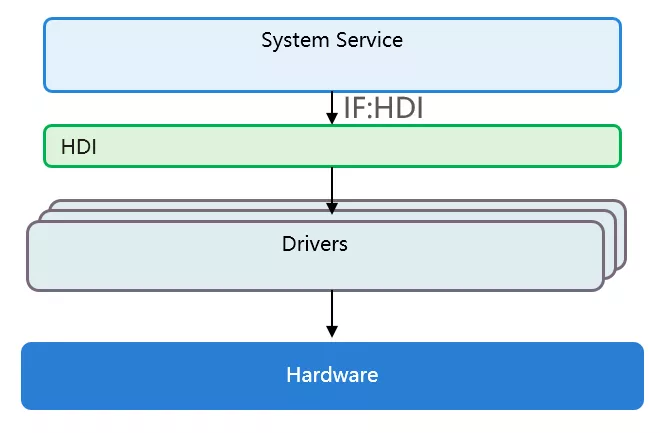
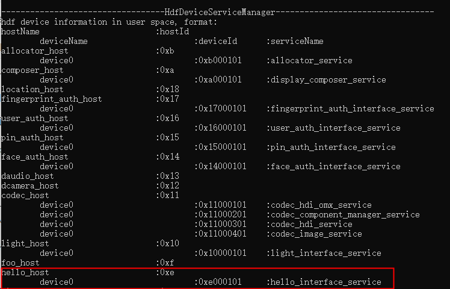

# Develop guide

## h2hdf工具使用场景

在OpenHarmony系统中，上层应用或服务层通过调用HDF框架提供的HDI接口，能够以一种标准化和抽象化的方式与底层硬件设备进行交互。使用h2hdf工具，用户只需提供一个drivername，工具会自动生成整个框架的代码，包含驱动配置文件、idl接口、驱动程序driver和驱动服务框架。

)

## h2hdf工具代码框架说明

```
napi_generator/src/cli/h2hdf

h2hdf
├── docs                                      # 文档
│   ├── usage.md                              # 使用文档
│   ├── develop.md                            # 设计文档        
├── src
│   ├── templete                              # 模板文件
│   │   ├── HcsconfigTemplete
│   │   │   ├── hcsconfigTemplete.gen         # hcs配置模板
│   │   ├── IdlInterfaceTemplete
│   │   │   ├── buildgnTemplete.gen           # idl接口BUILD.gn模板
│   │   │   ├── bundlejsonTemplete.gen        # idl接口bundle.json模板
│   │   │   ├── idlInterfaceTemplete.gen      # idl接口定义文件模板
│   │   ├── PeripheralTemplete
│   │   │   ├── DumpExampleTemplete           # dump示例
│   │   │   │   ├── buildgnTemplete.gen       # BUILD.gn模板
│   │   │   │   ├── dumpCTemplete.gen         # dump实现示例模板
│   │   │   │   ├── dumpHTemplete.gen         # dump h文件模板
│   │   │   ├── HdiServiceTemplete            # hdi_service 模板
│   │   │   │   ├── buildgnTemplete.gen       # BUILD.gn模板
│   │   │   │   ├── driverTemplete.gen        # driver模板
│   │   │   │   ├── logHTemplte.gen           # 日志文件模板
│   │   │   │   ├── serviceCppTemplete.gen    # 驱动服务模板
│   │   │   │   ├── serviceHTemplete.gen      # 驱动服务 h 文件模板
│   │   │   ├── buildgnTemplete.gen           # hdi service BUILD.gn模板
│   │   │   ├── bundlejsonTemplete.gen        # hdi service bundle.json模板
│   │   ├── framework.json                    # 存储模板对应相对路径   
│   ├── generate.js                           # 使用templete中对应的模板生成代码。
│   ├── main.js                               # 工具入口文件,定义输入参数，调用generate.js来启动代码生成过程。
├── package.json                              # Node.js打包配置文件
```

运行逻辑


// 脚本重要函数

```
// main.js

let ops = stdio.getopt({
    // 输入driver name ,输入一个字符串，默认为hello
    'drivername': { key: 'n', args: 1, description: 'driver name', default: 'hello' },
    // 输出文件夹路径
    'out': { key: 'o', args: 1, description: 'output directory', default: '.' },
});
```

```
// generate.js

/* 根据用户输入的driver名字生成framework框架
 * drivername:用户输入的驱动名，out:生成框架路径
 * 1. 读取json文件模板
 * 2. 替换模板中的名字并写文件输出
 */
function genDriverFramework(driverName, out = '') {
  // 读取Json文件，获取各模板路径
  let frameworkJsonPath = path.join(__dirname, './templete/framework.json');
  let frameworkJson = getJsonCfg(frameworkJsonPath);

  let frameworkPath = pathJoin(out, 'hdf');

  let namespaceName = driverName.substring(0,1).toUpperCase() + driverName.substring(1, driverName.length);
  let idlFileName = 'I' + namespaceName + 'Interface';
  let rootInfo = {
    'driverName': driverName,
    'namespaceName': namespaceName,
    'idlFileName': idlFileName,
  }

  // 生成Hcs配置文件
  genHcsconfigFile(frameworkJson, driverName, frameworkPath);

  // 生成Idl接口
  genInterface(frameworkPath, frameworkJson, rootInfo);

  // 生成hdi_service
  genPeripheral(frameworkPath,frameworkJson, rootInfo);
}
```

## 工具使用方法说明

### 生成

1.安装typescript：在napi_generator/src/cli/h2hdf/src目录下执行命令：

	npm i typescript

2.安装stdio：在napi_generator/src/cli/h2hdf目录下执行命令： 

	npm i stdio

3.在napi_generator/src/cli/h2hdf/src下执行以下命令生成ts声明文件：

```
node main.js -n hello
```

其中，参数详情如下：

  -n, drivername，例如：hello

  -o, 可选参数，默认为当前目录，指定生成框架代码输出路径。

6.执行成功后在napi_generator/src/cli/h2hdf/src/下生成hellohdf文件夹，文件夹中目录结构如下所示：

```
├── HcsConfig                                      # hcs配置文件
│   ├── device_info.hcs                            # 内容配置到源码vendor/hihope/rk3568/hdf_config/uhdf/device_info.hcs文件中
├── IdlInterface                                                             
│   ├── hello                                      # 拷贝到源码drivers/interface          
│   │   ├── v1_0              
│   │   │   ├── BUILD.gn                           
│   │   │   ├── IHelloInterface.idl                # idl接口               
│   │   ├── bundle.json
├── Peripheral                                     # 拷贝到源码drivers/peripheral
│   ├── hello                                             
│   │   ├── hal                                           
│   │   │   ├── include
│   │   │   │   ├── hello_dump.h                          
│   │   │   ├── BUILD.gn
│   │   │   ├── hello_dump.c                       # hidump实现              
│   │   ├── hdi_service                            # hdi_service
│   │   │   ├── BUILD.gn                           # 编译两个动态库：libhello_driver、libhello_interface_service_1.0
│   │   │   ├── hello_interface_driver.cpp         # driver：定义驱动入口的对象，将驱动入口注册到HDF框架中；在加载驱动时HDF框架会先调用Bind函数，再调用Init函数加载该驱动；当Init调用异常时，HDF框架会调用Release释放驱动资源并退出
│   │   │   ├── hello_interface_service.cpp        # 驱动服务
│   │   │   ├── hello_interface_service.h
│   │   ├── utils/interface
│   │   │   ├── hello_log.h                        # 日志文件
│   │   ├── BUILD.gn                               
│   │   ├── bundle.json
```

### 编译

1.将hellohdf/Peripheral文件夹下的hello文件夹拷贝到源码drivers/peripheral目录下，将hellohdf/IdlInterface文件夹下的hello文件夹拷贝到源码drivers/interface目录下，将hellohdf/HcsConfig/device_info.hcs中的内容拷贝到源码vendor/hihope/rk3568/hdf_config/uhdf/device_info.hcs文件中

2.配置产品：在源码productdefine/common/inherit/rich.json文件中增加以下代码：

```
{
   "component": "drivers_interface_hello",
   "features": []
},
```

其中drivers_interface_hello为drivers/interface/hello/v1_0/BUILD.gn中的part_name。

在源码productdefine/common/inherit/chipset_common.json文件中增加以下代码：

```
{
   "component": "drivers_peripheral_hello",
   "features": []
 },
```

其中drivers_peripheral_hello为drivers/peripheral/hello/bundle.json中的component。

3.编译，在源码下执行以下命令进行编译：

```
./build.sh --product-name rk3568
```

编译成功后，将源码下out/rk3568/packages/phone/image镜像烧录在dayu200开发板上

### 验证

#### 动态加载

1.查看hostId：hdc连接开发板，进入/vendor/etc/init路径下，并查看hdf_devhost.cfg文件，使用hdc命令如下：

```
cat hdf_devhost.cfg
```

根据hostName找到对应hostId，如本例的hostName为hello_host，对应找到“name”为“hello_host”那一项，查看“path”的第二个参数，则为hostName对应的hostId，即14，如下所示：


2.运行可执行文件hdf_devhost，手动拉起host：进入/vendor/bin路径下，运行可执行文件hdf_devhost，传入第一个参数为hostId，第二个参数为hostName；运行命令如下所示：

```
./hdf_devhost 14 hello_host
```

3.查看host是否加载：新开一个命令行窗口，hdc进入开发板，执行以下命令查看进程是否拉起：

```
ps -A | grep host
```

屏幕显示hello_host进程号，则表明host已被拉起


4.使用hidumper查看更多细节信息：

查询所有正在运行的host

```
 hidumper -s HdfDeviceServiceManager -a "-query"
```



```
----------------------------------HdfDeviceServiceManager--------------------------------
hdf device information in user space, format:
...
hello_host                        :0xf
        device0                         :0xf000101     :hello_interface_service
```

使用hidumper查看更多信息

```
hidumper -s HdfDeviceServiceManager -a "-host hello_host -c"
```

打印出Hello, World!


#### 静态加载

// todo 待补充

