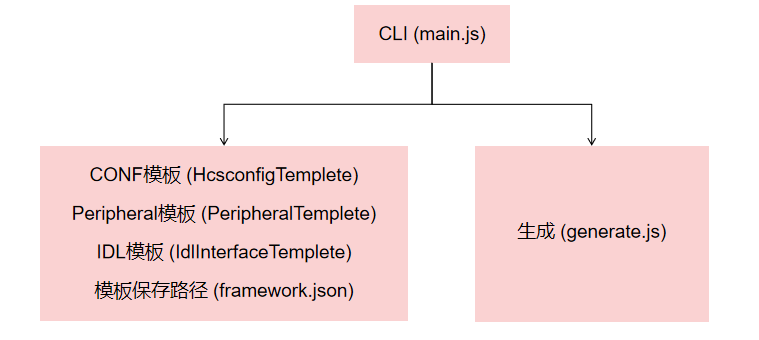
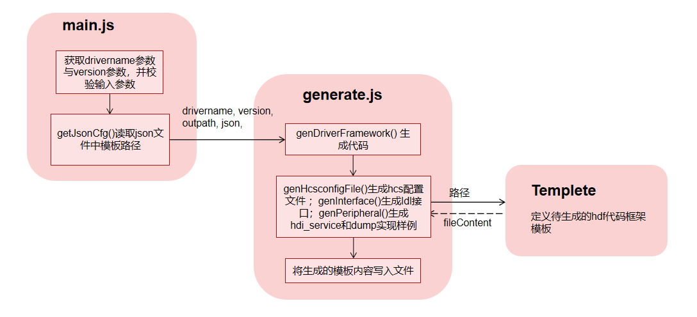

# Develop Guide

## h2hdf工具使用场景

在OpenHarmony系统中，上层应用或服务层通过调用HDF框架提供的HDI接口，能够以一种标准化和抽象化的方式与底层硬件设备进行交互。使用h2hdf工具，用户只需提供一个drivername，工具会自动生成整个框架的代码，包含驱动配置文件、idl接口、驱动程序driver和驱动服务框架。



## h2hdf工具代码框架说明

```
h2hdf
├── docs                                      # 文档
│   ├── figures                               # 图片资源
│   ├── usage.md                              # 使用文档
│   ├── develop.md                            # 设计文档        
├── src
│   ├── templete                              # 模板文件
│   │   ├── HcsconfigTemplete
│   │   │   ├── hcsconfigTemplete.gen         # hcs配置模板
│   │   ├── IdlInterfaceTemplete
│   │   │   ├── buildgnTemplete.gen           # idl接口BUILD.gn模板
│   │   │   ├── v4_1
│   │   │   │   ├── bundlejsonTemplete.gen    # idl接口bundle.json模板
│   │   │   ├── idlInterfaceTemplete.gen      # idl接口定义文件模板
│   │   ├── PeripheralTemplete
│   │   │   ├── DumpExampleTemplete           # dump示例
│   │   │   │   ├── v4_1
│   │   │   │   │   ├── buildgnTemplete.gen   # BUILD.gn模板
│   │   │   │   ├── dumpCTemplete.gen         # dump实现示例模板
│   │   │   │   ├── dumpHTemplete.gen         # dump h文件模板
│   │   │   ├── HdiServiceTemplete            # hdi_service 模板
│   │   │   │   ├── v4_1
│   │   │   │   │   ├── buildgnTemplete.gen   # BUILD.gn模板
│   │   │   │   ├── driverTemplete.gen        # driver模板
│   │   │   │   ├── logHTemplte.gen           # 日志文件模板
│   │   │   │   ├── serviceCppTemplete.gen    # 驱动服务模板
│   │   │   │   ├── serviceHTemplete.gen      # 驱动服务 h 文件模板
│   │   │   ├── buildgnTemplete.gen           # hdi service BUILD.gn模板
│   │   │   ├── v4_1
│   │   │   │   ├── bundlejsonTemplete.gen    # hdi service bundle.json模板
│   │   ├── framework.json                    # 存储模板对应相对路径   
│   ├── generate.js                           # 使用templete中对应的模板生成代码。
│   ├── main.js                               # 工具入口文件,定义输入参数，调用generate.js来启动代码生成过程。
├── package.json                              # Node.js打包配置文件
```

运行逻辑



main.js为脚本入口，其中使用stdio.getopt获取参数，其中，参数详情如下：

  -n, drivername，例如：hello

  -v, 可选参数，版本，默认为4.1

  -o, 可选参数，默认为当前目录，指定生成框架代码输出路径。

```
let ops = stdio.getopt({
    // 输入driver name ,输入一个字符串，默认为hello
    'drivername': { key: 'n', args: 1, description: 'driver name', default: 'hello' },
    // 输入版本号
    'version': { key: 'v', args: 1, description: 'source version', default: '4.1' },
    // 输出文件夹路径
    'out': { key: 'o', args: 1, description: 'output directory', default: '' },
});
```

对输入的参数值进行校验：checkInput对输入的drivername进行校验，输入的drivername必须符合命名规范；isValidValue对输入的版本号进行校验，输入的版本号必须包含在版本号数组中，该数组后续可持续更新：

```
...
const allowedVersion = ['4.1'];
function isValidValue(value, allowedVersion) {
  return allowedVersion.includes(value);
}

function checkInput(input) {
  const regex = /\b[a-zA-Z_][a-zA-Z0-9_]*\b/;
  return regex.test(input);
}
```

获取到每个模板的路径后，根据路径读取模板文件，并替换模板文件中的drivername等：

```
/* 根据用户输入的driver名字生成framework框架
 * drivername:用户输入的驱动名，frameworkJson: 模板内容，out:生成框架路径
 * 替换模板中的名字并写文件输出
 */
function genDriverFramework(driverName, frameworkJson, version, out = '') {
  ...
  // 生成Hcs配置文件
  genHcsconfigFile(frameworkJson, driverName, frameworkPath);
  // 生成Idl接口
  genInterface(frameworkPath, frameworkJson, rootInfo);
  // 生成hdi_service
  genPeripheral(frameworkPath, frameworkJson, rootInfo);
}
```

## 开发指导

### 适配新版本

适配新版本的步骤如下：

1.在main.js中，在allowedVersion数组中加入适配的版本号，其中版本号需统一写法，如4.1

2.在templete目录下，IdlInterfaceTemplete目录下新建适配版本文件夹，如v4_1，在适配版本文件夹下新增bundle.json模板，在 Periphheral, Periphheral/DumpExampleTemplete, Periphheral/HdiServiceTemplete新增适配版本文件夹，在适配版本下新增对应的BUILD.gn模板，并在framework.json中新增版本的bundle.json,BUILD.gn模板路径。

3.在generate.js中，在genInterface方法、genExampleDumpfile方法、genHdiService方法、genBuildFile方法中修改相应代码：当rootInfo.version为新增版本时，替换对应的BUILD.gn, bundle.json模板路径。

4.适配新版本增加其它配置时，可在templete目录下增加配置模板，并在framework.json中增加配置文件模板的路径，然后在generate.js中替换模板并生成配置文件。

## Roadmap

| 工作目标                      | 工作内容                                                     | 验收要求                                                     | 时间节点         |
| ----------------------------- | ------------------------------------------------------------ | ------------------------------------------------------------ | ---------------- |
| 支持一个简单的sample_host模板 | 根据工具基于OpenHarmony4.1源码，编写脚本生成Hdf框架模板，其中包括hcsconfig模板，idl接口模板，peripheral模板 | 生成之后可动态加载Host，并能使用Hidump查看日志，打印出"hello word!" | 2024.8（已完成） |
| 完善host模板                  | 增加testapp测试程序；完善模板中hitrace日志跟踪定位工具的使用；模板中增加死亡监听：客户端监听服务端消亡、服务端监听客户端消亡、服务端监听底层HDI侧消亡 | 驱动host能随镜像起来，服务端/客户端/HDI侧消亡时能打印出日志；检测接口被调用时打印hitrace日志 | 2024.10          |
| 适配5.0                       | 适配5.0release版本                                           | 适配5.0时，可以编译出对应版本的工具，且编译验证成功          | 2024.11          |

