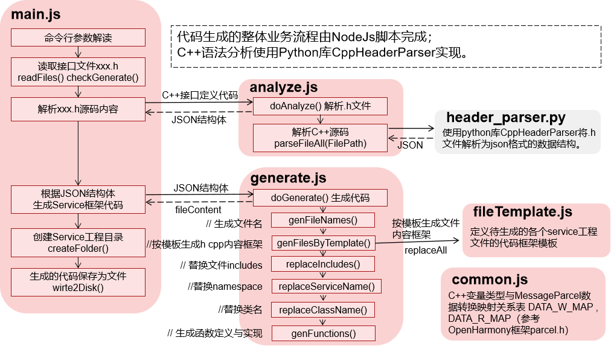

## Develop guide

### Service代码生成工具使用场景

​		当开发人员为OpenHarmony系统框架开发某些功能时，有时需要将这个功能包装成一个独立的服务进程运行在系统中，为了其它应用进程能够调用此服务，开发人员需要基于系统IPC通信框架编写一套远程接口调用实现。		Service代码生成工具能够帮助用户生成框架代码，提升开发效率。用户只需提供一个定义远程方法的.h头文件，工具会自动生成整个Service框架的代码，包含Ability注册、proxy/stub类实现、MessageParcel数据包构造、Service子系统编译及开机自启动相关配置文件。用户可基于框架代码专注于业务功能的编写。

---

### Service工具代码框架说明

~~~
napi_generator\src\cli\h2sa

h2sa
├── docs                                      //文档，（后续文档会整理在一起）
├── examples                                  //样例，测试h文件
│   ├── sample.h
│   └── test.h            
├── h2sa_DEVELOP_README_ZH.md                 //开发文档
├── README_ZH.md                              //usage,使用说明
└── src
    ├── package.json                          //Node.js打包配置文件
    └── src
        ├── gen
        │   ├── analyze.js                    //包含用于分析C++头文件的逻辑。读取头文件内容；解析文件以提取类、方法、参数等信息。
        │   ├── fileTemplate.js               //包含生成代码时使用的模板字符串。模板中的占位符将在代码生成过程中被实际的数据替换，以生成所需的代码文件。（之后换成inl或者tmpl模板文件，并分出不同版本的文件夹，不同类型的文件）
        │   ├── generate.js                   //包含核心的代码生成逻辑。调用analyze.js来获取分析结果；使用fileTemplate.js中的模板和分析结果来生成代码。
        │   ├── header_parser.py              //脚本，与analyze.js协同工作，用于解析C++头文件
        │   └── main.js                       //项目的入口。初始化日志记录和其他工具；解析命令行参数，以确定用户想要执行的操作；调用generate.js来启动代码生成过程。
        └── tools
            ├── common.js                     //包含整个项目中使用的通用函数和常量
            ├── FileRW.js                     //包含文件读写操作的JavaScript模块
            ├── NapiLog.js                    //日志记录模块
            ├── re.js                         //包含正则表达式相关功能的模块
            └── tool.js                       //包含一些辅助工具函数
~~~

运行逻辑

~~~

### 工具使用方法说明

1. 安装python库 CppHeaderParser

   ~~~
   pip install CppHeaderParser
   ~~~

2. 安装typescript：在napi_generator/src/cli/h2sa/src/src目录下执行命令

   ~~~
   npm i typescript
   ~~~

3. 安装stdio：在napi_generator/src/cli/h2sa/src目录下执行命令

   ~~~
   npm i stdio
   ~~~

4. 将待转换的文件test.h文件拷贝到napi_generator/src/cli/h2sa/src/src/gen目录下

5. 在napi_generator/src/cli/h2sa/src/src/gen目录下执行命令生成service框架代码：

   ~~~
   node main.js -f test.h
   ~~~

   其中,参数详情如下： -f，定义远程服务的.h文件； -l, 日志级别（0-3），默认为1； -o,生成框架代码输入到指定路径下； -s,指定serviceID。 -v,指定版本（3.2和4.1，默认版本为3.2） 

6. 输出testservice文件夹

   ~~~
   /xxxservice
   ├── BUILD.gn                                             # 整个服务的编译文件，包含2个内容:1)服务端程序动态库编译  2)客户端可执行程序编译
   ├── bundle.json                                          # 将服务包装成一个OpenHarmoney子系统组件，提供相关信息
   ├── etc                                                  # 服务启动配置目录，如果服务不需要开机自动启动，可以删除此目录。
   │   ├── BUILD.gn
   │   └── test_service.cfg                                 # 服务自启动配置文件，编译烧录后会在/ect/init/下生成xxx_service.cfg启动文件
   ├── include
   │   ├── test_service.h                                   # 服务端头文件
   │   ├── test_service_proxy.h                             # proxy 客户端头文件，为开发人员封装remote请求发送的处理
   │   └── test_service_stub.h                              # stub 服务端头文件，为开发人员封装remote请求接收的处理
   ├── interface
   │   └── i_test_service.h                                 # 由用户提供的.h文件生成的remote接口文件，stub和proxy都基于此文件实现接口。
   ├── sa_profile
   │   ├── 9000.json
   │   └── BUILD.gn
   └── src
       ├── i_test_service.cpp
       ├── test_client.cpp
       ├── test_service.cpp
       ├── test_service_proxy.cpp
       └── test_service_stub.cpp
   ~~~
