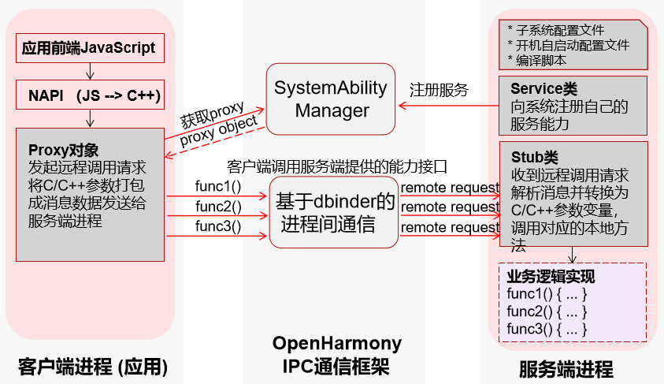

## Develop guide

### Service代码生成工具使用场景

​		当开发人员为OpenHarmony系统框架开发某些功能时，有时需要将这个功能包装成一个独立的服务进程运行在系统中，为了其它应用进程能够调用此服务，开发人员需要基于系统IPC通信框架编写一套远程接口调用实现。		Service代码生成工具能够帮助用户生成框架代码，提升开发效率。用户只需提供一个定义远程方法的.h头文件，工具会自动生成整个Service框架的代码，包含Ability注册、proxy/stub类实现、MessageParcel数据包构造、Service子系统编译及开机自启动相关配置文件。用户可基于框架代码专注于业务功能的编写。

---

### Service工具代码框架说明

~~~
napi_generator\src\cli\h2sa

h2sa
├── docs                                      //文档，（后续文档会整理在一起）
├── examples                                  //样例，测试h文件
│   ├── sample.h
│   └── test.h            
├── h2sa_DEVELOP_README_ZH.md                 //开发文档
├── README_ZH.md                              //usage,使用说明
└── src
    ├── package.json                          //Node.js打包配置文件
    └── src
        ├── gen
        │   ├── analyze.js                    //包含用于分析C++头文件的逻辑。读取头文件内容；解析文件以提取类、方法、参数等信息。
        │   ├── fileTemplate.js               //包含生成代码时使用的模板字符串。模板中的占位符将在代码生成过程中被实际的数据替换，以生成所需的代码文件。（之后换成inl或者tmpl模板文件，并分出不同版本的文件夹，不同类型的文件）
        │   ├── generate.js                   //包含核心的代码生成逻辑。调用analyze.js来获取分析结果；使用fileTemplate.js中的模板和分析结果来生成代码。
        │   ├── header_parser.py              //脚本，与analyze.js协同工作，用于解析C++头文件
        │   └── main.js                       //项目的入口。初始化日志记录和其它工具；解析命令行参数，以确定用户想要执行的操作；调用generate.js来启动代码生成过程。
        └── tools
            ├── common.js                     //包含整个项目中使用的通用函数和常量
            ├── FileRW.js                     //包含文件读写操作的JavaScript模块
            ├── NapiLog.js                    //日志记录模块
            ├── re.js                         //包含正则表达式相关功能的模块
            └── tool.js                       //包含一些辅助工具函数
~~~

### 运行逻辑

main.js为脚本入口，其中使用stdio.getopt获取参数，其中,参数详情如下： 

​	-f，定义远程服务的.h文件； 

​	-l,  日志级别（0-3），默认为1； 

​	-o, 生成框架代码输入到指定路径下； 

​	-s, 指定serviceID。 -

​	-v, 指定版本（3.2和4.1，默认版本为3.2） 

~~~
let ops = stdio.getopt({
    'filename': { key: 'f', args: 1, description: '.h file', default: '' },
    'out': { key: 'o', args: 1, description: 'output directory', default: '.' },
    'loglevel': { key: 'l', args: 1, description: 'Log Level: 0~3', default: '1' },
    'serviceId': { key: 's', args: 1, description: 'service register id: 9000~16777214', default: '9000' },
    'versionTag': { key: 'v', args: 1, description: 'version tag: 4.1 / 3.2', default: '3.2' }
});
~~~

### 开发指导

#### 适配新版本

若当前工具不能满足需要，用户可对工具进行二次开发。例如：当前工具适配的源码版本是4.1，若用户需要适配其它版本，用户需修改以下文件进行适配：

**9月份会进行代码去重整改，预估适配方式如下，整改后如有出入，会进行修改**

1.在main.js中，在allowedVersion数组中加入适配的版本号，如4.1统一为v4_1, 5.0统一为v5_0。

2.在templete目录下，以适配5.0源码为例，IdlInterfaceTemplete目录下新建v5_0文件夹，在v5_0文件夹下新增对应的bundle.json模板，对应的BUILD.gn模板；新增5.0版本的bundle.json,BUILD.gn模板路径。

3.在generate.js中，在doGenerate方法、genFilesByTemplate方法、genFileNames方法中修改相应代码：当rootInfo.version为v5_0时，替换对应的BUILD.gn, bundle.json模板路径。

若适配新版本需要增加其它配置，可在templete目录下增加配置模板，并增加配置文件模板的路径，最后在generate.js中生成最终配置文件。

#### roadMap

| 时间点 | 预期任务                                                     | 验收标准                                                     | 完成情况 |
| :----- | ------------------------------------------------------------ | ------------------------------------------------------------ | -------- |
| 9月份  | 1，代码去重方案提供（不同版本模板，proxy-stub框架，hidumper框架，hitrace）； 2，适配5.0release版本，增加代码中hidump、hitrace等日志跟踪定位工具的使用； | 1，设计文档； 2，适配5.0时，可以编译出对应版本的工具，且编译验证成功 |          |
| 10月份 | 增加testapp调用 sa接口，包括死亡监听；                       | testapp                                                      |          |

