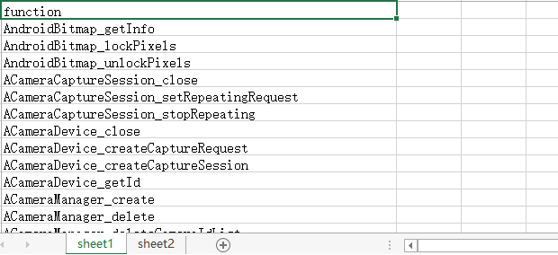
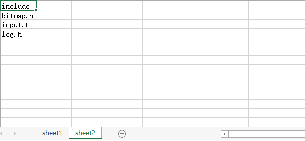

# API扫描工具IntelliJ插件说明(暂不支持)

## 简介

API扫描工具，它可以根据用户给定三方库项目扫描输出风险接口。目前工具支持可执行文件、VS Code插件、IntelliJ插件三种入口，本文主要介绍IntelliJ插件使用说明。

## 目录 

	├── napi_generator/src/tool/api                           # API扫描工具
	│   ├── ...                                               # 其它文件
	│   ├── api_scan_IntelliJ_plugin                          # IntelliJ插件代码
	│   │   ├── docs                                          # IntelliJ插件说明
	│   │   ├── resources                                     # IntelliJ插件说明
	│   │   ├── src    				                          # IntelliJ插件源码
	│   │   └── README_zh                                     # IntelliJ插件说明

## 约束 

系统：建议Windows 10

依赖版本：JDK 11

开发工具：DevEco Studio、IDEA Community 2021.3.3

## 使用方法 

### 使用对象

系统开发者

### 使用场景

移植三方库到OpenHarmony前预知风险接口。

### 工具使用

插件下载路径如下:

[下载链接](暂无)

具体的工具使用步骤，可以左键单击以下链接了解：

[工具使用说明](https://gitee.com/openharmony/napi_generator/tree/master/src/tool/api/api_scan_IntelliJ_plugin/docs/INSTRUCTION_ZH.md)

### 工具输出

根据使用者指定三方库项目源码，工具会输出风险接口。为了方便使用者快速上手工具，此处使用opencv项目为例，项目目录如下：

在window环境下的，根据输入三方库项目,生成的输出文件result.xlsx，如下所示：

其中生成的result.xlsx文件，风险接口如下所示：

## 开发说明

### 对象

工具的开发者

### 开发场景

若当前工具的功能已经不能满足开发者的全部需求，则开发者可以基于已有的源码对工具进行二次开发，来增强工具的能力，编译打包生成自定义的可执行文件和插件。
       
### 开发步骤

开发者可以根据如下的步骤来完成对工具IntelliJ插件的开发：

[工具开发说明](https://gitee.com/openharmony/napi_generator/tree/master/src/tool/api/docs/DEVELOP_ZH.md)

## FAQ

对于常见问题解决方法指导如下：

[FAQ](https://gitee.com/openharmony/napi_generator/tree/master/src/tool/api/FAQ.md)

## 相关仓

暂无