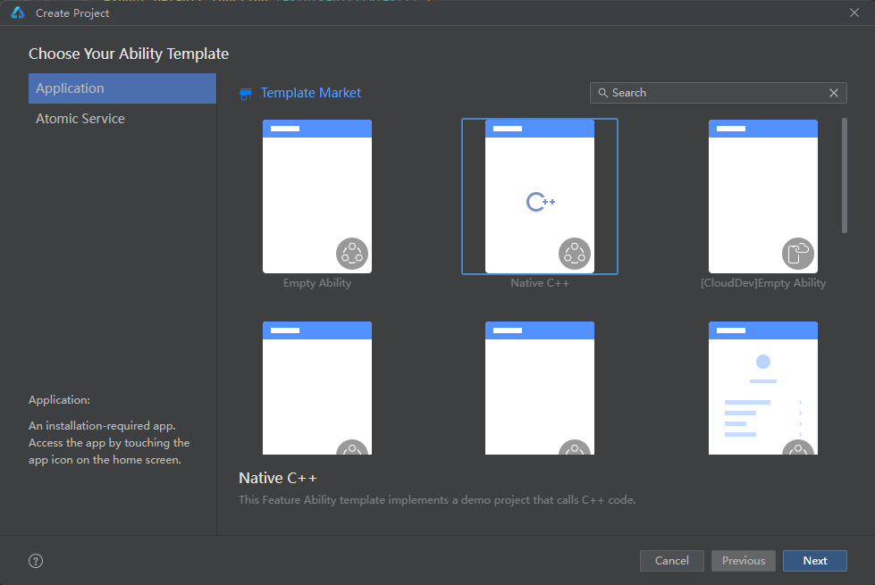
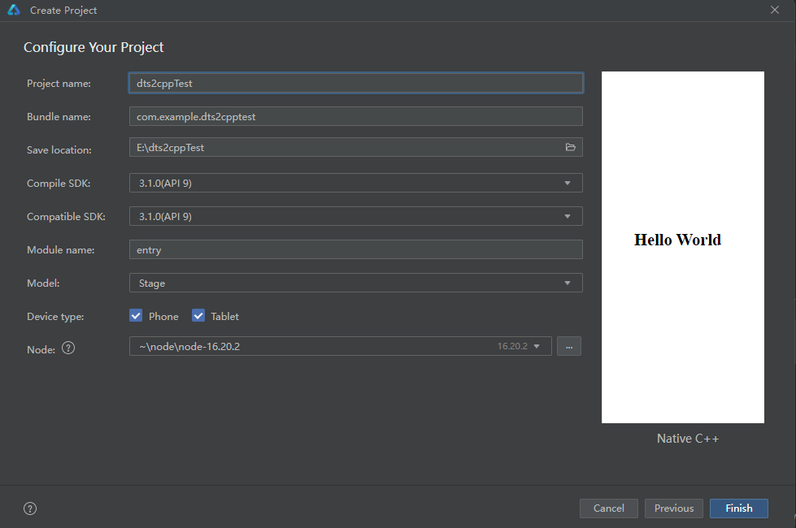
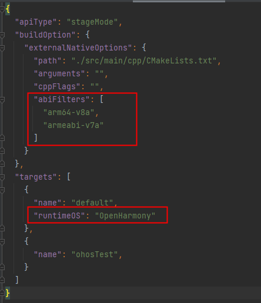
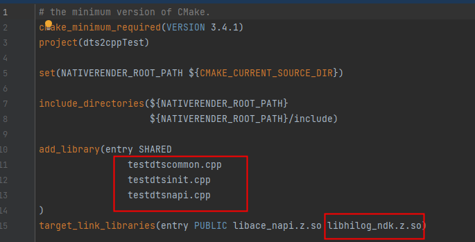
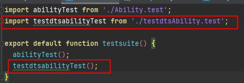

# dts2cpp使用文档

## 环境

DevEco Studio: Build Version: 4.1.0.400, built on April 9, 2024

## 创建工程

1.打开 DevEco Studio：

选择Create Project -> Application -> Native C++ ，然后点击Next，将Project name修改为dts2cppTest，点击Finish，则工程创建成功。





2.修改编译选项：在dts2cppTest/entry/build-profile.json5文件中buildOption/externalNativeOptions中增加abiFilters字段， 并将targets字段的runtimeOS改为OpenHarmony

```
"abiFilters": [
        "arm64-v8a",
        "armeabi-v7a"
]
```

```
"runtimeOS": "OpenHarmony"
```



## 测试生成物                                            

1.将生成文件拷贝至工程相应路径下

1.1将生成目录下的cpp目录下的所有文件拷贝到工程目录dts2cppTest/entry/src/main/cpp目录下，并将所有cpp文件加入编译选项，在target_link_libraries中加入hilog：

```
libhilog_ndk.z.so
```

修改后的CMakeLists.txt文件如下所示：



1.2将生成目录下的ets目录下的ets文件（testdtsAbility.test.ets）拷贝到工程目录dts2cppTest/entry/src/ohosTest/ets/test目录下，

在dts2cppTest/entry/src/ohosTest/ets/test/List.test.ets中导入testdtsAbility.test.ets:

```
import abilityTest from './Ability.test';
import testdtsabilityTest from './testdtsAbility.test';

export default function testsuite() {
  abilityTest();
  testdtsabilityTest();
}
```



1.3将转换的dts文件 (testdts.d.ts) 中所有内容拷贝到 dts2cppTest/entry/src/main/cpp/types/libentry/index.d.ts中（不覆盖原有内容）。

2.确认生成物是否能编译

2.1对工程签名：File->Project Structure ->Project -> Signing Configs


2.2运行dts2cppTest/entry/src/ohosTest/ets/test/testdtsAbility.test.ets中的测试集testdtsActsAbilityTest，用例成功运行，并打印出相关log。


例如：方法testFunc打印出默认对象值：


